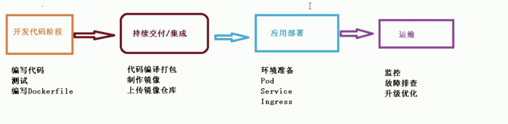

### 一、容器交付流程

### 1、大致流程



### 2、细节流程


## 二、部署Java项目

### 1、准备一个java项目

+ 第一步：将java项目进行打包(jar包或者war包)
+ 第二步：制作镜像

### 3、登录到阿里云docker仓库

```
## 登录
sudo docker login --username=吴志旋sy registry.cn-hangzhou.aliyuncs.com

## 给镜像打上标签
sudo docker tag 0c3a7ebdf479 registry.cn-hangzhou.aliyuncs.com/wuzhixuan/test_pull_image:1.0

## 推送到阿里云
docker push registry.cn-hangzhou.aliyuncs.com/wuzhixuan/test_pull_image
```

