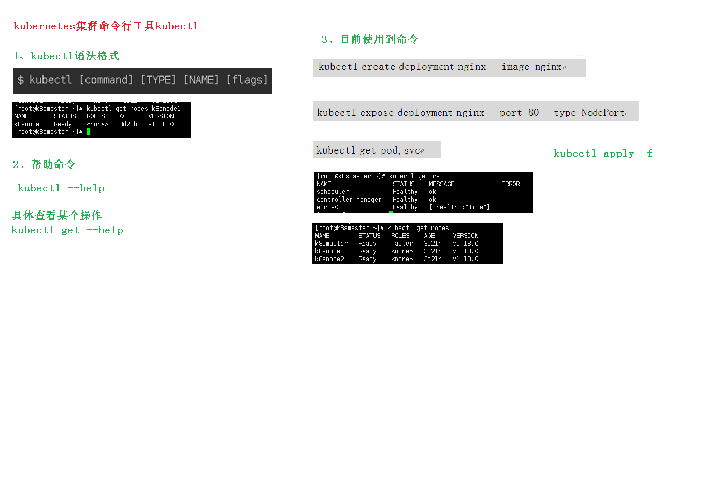
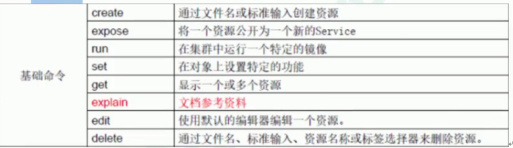
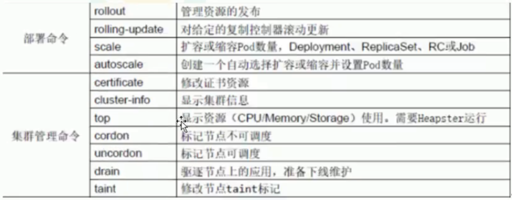
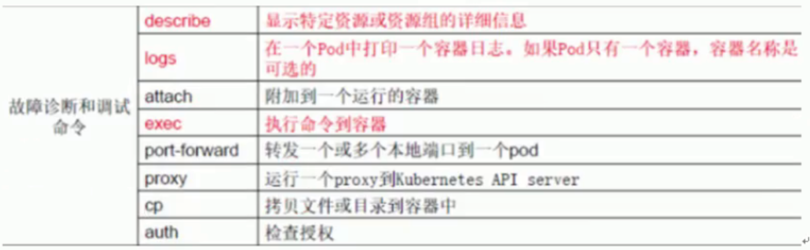
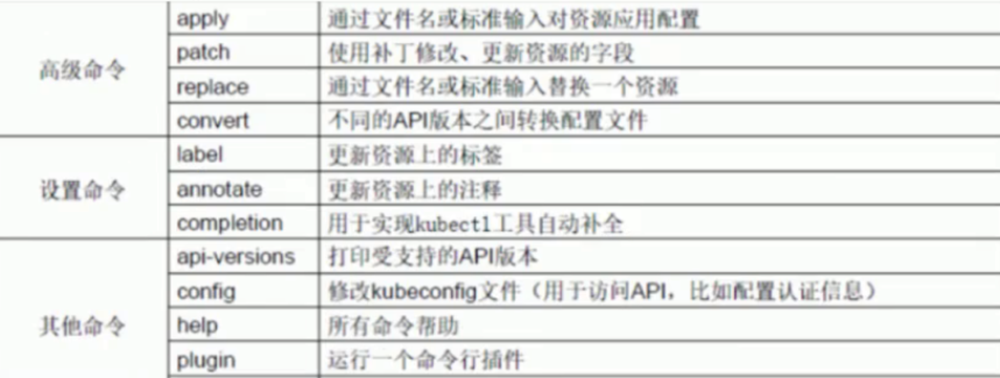

[TOC]

## 1、kubectl概述

+ kubectl是Kubernetes集群的命令行工具，通过kubectl能够对集群本身进行管理，并能够在集群上进行容器化应用的安装部署

## 2、kubectl命令的语法

+ 

```
kubectl [command] [TYPE] [NAME][flags] 
```

+ command :指定要对资源执行的操作，例如`create` 、`get `、`describe`、`delete`
+ TYPE:指定资源类型，资源类型是**大小写敏感**的，开发这能够以单数、复数、和缩略的形式

```
kubectl get pod pod1
kubectl get pods pod1
kubectl get po pod1
```

+ NAME:指定资源的名称，名称也是大小写敏感的。如果省略名称，这会显示所有的资源
+ Flags: 指定可选的参数。例如，可用-s或者-server参数指定Kubernetes API server的地址和端口

## 3、kubectl help获取更多信息

```
kubectl --help
```

## 4、kubectl 子命令使用分类

### 4.1 基础命令

​	

### 4.2部署和集群的管理命令



### 4.3故障和调试命令



### 4.4 其他命令



