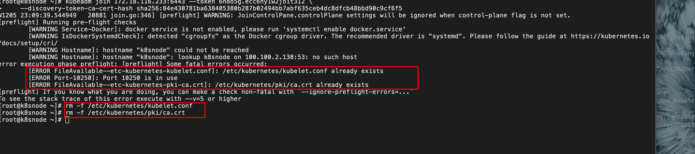

[TOC]

# 使用kubeadm方式搭建kuberneters集群

## 1. 对操作系统进行初始化操作

```
# 关闭防火墙
  systemctl stop firewalld
  systemctl disable firewalld

# 关闭selinux
sed -i 's/enforcing/disabled/' /etc/selinux/config # 永久
sentenforce 0 # 临时

# 关闭swap
swapoff -a # 临时
sed -ri 's/.*swap.*/#&/' /etc/fstab #永久

# 根据规划设置主机名
hostnamectl set-hostname <hostname>

# 在master 添加hosts
cat >> /etc/host <<EOF
172.18.116.233 k8sMaster
172.18.116.232 k8snode
EOF

# 将桥接的IPv4流量传递到iptables的链
cat > /etc/sysctl.d/k8s.conf << EOF
net.bridge.bridge-nf-call-ip6tables =1 
net.bridge.bridge-nf-call-iptables =1 
net.ipv4.ip_forward = 1
EOF
sysctl --system #生效

由于开启内核 ipv4 转发需要加载 br_netfilter 模块，所以加载下该模块：
modprobe br_netfilter

# 安装 ipvs：
$ cat > /etc/sysconfig/modules/ipvs.modules <<EOF
#!/bin/bash
modprobe -- ip_vs
modprobe -- ip_vs_rr
modprobe -- ip_vs_wrr
modprobe -- ip_vs_sh
modprobe -- nf_conntrack_ipv4
EOF
$ chmod 755 /etc/sysconfig/modules/ipvs.modules && bash /etc/sysconfig/modules/ipvs.modules && lsmod | grep -e ip_vs -e nf_conntrack_ipv4

# 安装了 ipset 软件包：

 yum install ipset
 
#为了便于查看 ipvs 的代理规则，最好安装一下管理工具 ipvsadm：
 yum install ipvsadm

# 同步服务器时间
$ yum install chrony -y
$ systemctl enable chronyd
$ systemctl start chronyd
$ chronyc sources
```

## 2. 安装docker


## 3.添加阿里云YUM源

```
cat > /etc/yum.repos.d/kubernetes.repo << EOF
[kubernetes]
name=Kubernetes
baseurl=https://mirrors.aliyun.com/kubernetes/yum/repos/kubernetes-el7-x86_64
enabled=1
gpgcheck=1
repo_gpgcheck=0
gpgkey=https://mirrors.aliyun.com/kubernetes/yum/doc/yum-key.gpg https://mirrors.aliyun.com/kubernetes/yum/doc/rpm-package-key.gpg
EOF
```

## 4. 安装kubeadm,kubelet和kubectl

由于版本频繁更新，这里指定版本号

```
yum install -y kubelet-1.18.0 kubeadm-1.18.0 kubectl-1.18.0
     systemctl enable kubelet
```

## 5.部署Kubernetes Master

在master执行

```
kubeadm init --apiserver-advertise-address=120.24.33.237 --image-repository registry.aliyuncs.com/google_containers --kubernetes-version v1.18.0 --service-cidr=10.96.0.0/12 --pod-network-cidr=10.244.0.0/16 --ignore-preflight-errors=NumCPU
```

## 6.使用kubectl工具：

```
      mkdir -p $HOME/.kube
  sudo cp -i /etc/kubernetes/admin.conf $HOME/.kube/config
  sudo chown $(id -u):$(id -g) $HOME/.kube/config
```

异常处理：



```
rm -f /etc/kubernetes/kubelet.conf
rm -f /etc/kubernetes/pki/ca.crt
```


## 7.部署CNI网络插件

```
wget https//:raw.githubser.com/coreos/flannel/master/Documentation/kube-flannel.yml
```

默认镜像地址无法访问，sed命令修改为docker hub镜像仓库。

```
kubectl apply -f https://raw.githubusercontent.com/coreos/flannel/master/Documentation/kube-flannel.yml

kubectl get pods -n kube-system
NAME                          READY   STATUS    RESTARTS   AGE
kube-flannel-ds-amd64-2pc95   1/1     Running   0          72s
```

##  8 .测试kubernetes集群

```
$ kubectl create deployment nginx --image=nginx
$ kubectl expose deployment nginx --port=80 --type=NodePort
$ kubectl get pod,svc
```

访问地址：http://NodeIP:Port  (阿里云的话可以使用公网ip+对应的端口号访问)

```
sudo docker run -d \
  --restart=unless-stopped \
  --name=kuboard \
  -p 10080:80/tcp \
  -p 10081:10081/udp \
  -p 10081:10081/tcp \
  -e KUBOARD_ENDPOINT="http://192.168.0.60:10080" \
  -e KUBOARD_AGENT_SERVER_UDP_PORT="10081" \
  -e KUBOARD_AGENT_SERVER_TCP_PORT="10081" \
  -v /root/kuboard-data:/data \
  eipwork/kuboard:v3
```

