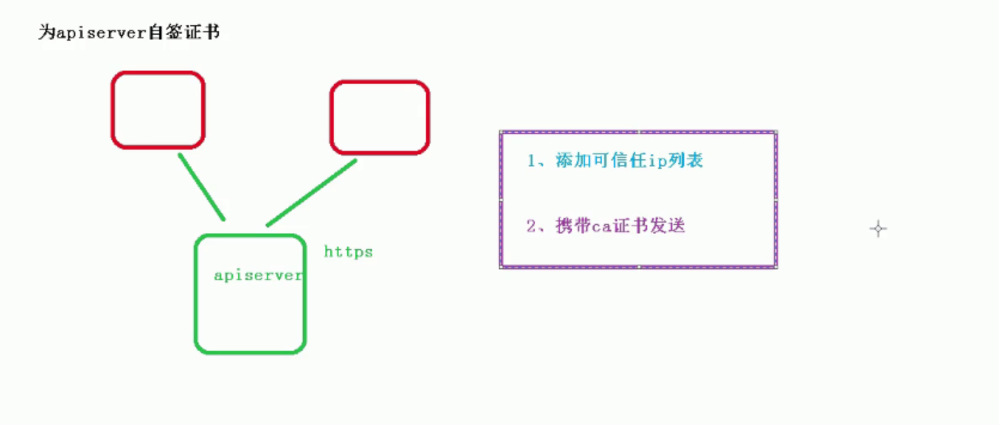

[TOC]

# 使用二进制方式搭建k8s集群

## 1、操作系统初始化(和之前一样)

## 2、为etcd和apiserver`自签证书`

### 2.1 准备cfssl证书生成工具

cfssl是一个开源的证书管理工具，使用`json`文件生成证书，相比openssl更方便使用

**下载**

```
wget https://pkg.cfssl.org/R1.2/cfssl_linux-amd64
wget https://pkg.cfssl.org/R1.2/cfssljson_linux-amd64
wget https://pkg.cfssl.org/R1.2/cfssl-certinfo_linux-amd64
chmod +x cfssl_linux-amd64 cfssljson_linux-amd64 cfssl-certinfo_linux-amd64
mv cfssl_linux-amd64 /usr/bin/cfssl
mv cfssljson_linux-amd64 /usr/bin/cfssljson
mv cfssl-certinfo_linux-amd64 /usr/bin/cfssl-certinfo
```

### 2.2 创建证书json文件

```
cfssl print-defaults config > config.json # 默认配置模板
cfssl print-defaults csr > csr.json #默认csr请求模板

mkdir etcd_ca
cd etcd_ca
```


### 2.3创建 Etcd根证书配置文件

```
cat > ca-config.json <<EOF
{
  "signing": {
    "default": {
      "expiry": "87600h"
    },
    "profiles": {
      "www": {
         "expiry": "87600h",
         "usages": [
            "signing",
            "key encipherment",
            "server auth",
            "client auth"
        ]
      }
    }
  }
}
EOF
```

### 2.4创建 Etcd根证书请求文件

```
cat > ca-csr.json <<EOF
{
    "CN": "etcd CA",
    "key": {
        "algo": "rsa",
        "size": 2048
    },
    "names": [
        {
            "C": "CN",
            "L": "Shanghai",
            "ST": "Shanghai"
        }
    ]
}
EOF
```

### 2.5创建 Etcd服务证书请求文件

```
cat > server-csr.json <<EOF
{
    "CN": "etcd",
    "hosts": [
        "10.100.97.78",
        "10.100.97.79",
        "10.100.97.55"
        ],
    "key": {
        "algo": "rsa",
        "size": 2048
    },
    "names": [
        {
            "C": "CN",
            "L": "BeiJing",
            "ST": "BeiJing"
        }
    ]
}
EOF
```

### 2.6 生成 Etcd根证书

```
cfssl gencert -initca ca-csr.json | cfssljson -bare ca -
```


### 2.7生成 Etcd服务证书

```
cfssl gencert -ca=ca.pem -ca-key=ca-key.pem -config=ca-config.json -profile=www server-csr.json | cfssljson -bare server
```


## 3、部署etcd存储集群

### 3.1从github下载二进制文件

下载地址：https://github.com/etcd-io/etcd/releases/download/v3.3.18/etcd-v3.3.18-linux-amd64.tar.gz

  ```
  wget https://github.com/etcd-io/etcd/releases/download/v3.3.18/etcd-v3.3.18-linux-amd64.tar.gz
  mkdir /opt/etcd/{bin,cfg,ssl} -p
  tar zxvf etcd-v3.3.18-linux-amd64.tar.gz
  mv etcd-v3.3.18-linux-amd64/{etcd,etcdctl} /opt/etcd/bin/
  cp ~/etcd_ca/*.pem /opt/etcd/ssl/
  ```

### 3.2生成etcd.server文件

```
[Unit]
Description=Etcd Server
After=network.target
After=network-online.target
Wants=network-online.target

[Service]
Type=notify
EnvironmentFile=/opt/etcd/cfg/etcd.conf
ExecStart=/opt/etcd/bin/etcd \
--cert-file=/opt/etcd/ssl/server.pem \
--key-file=/opt/etcd/ssl/server-key.pem \
--peer-cert-file=/opt/etcd/ssl/server.pem \
--peer-key-file=/opt/etcd/ssl/server-key.pem \
--trusted-ca-file=/opt/etcd/ssl/ca.pem \
--peer-trusted-ca-file=/opt/etcd/ssl/ca.pem
Restart=on-failure
LimitNOFILE=65536

[Install]
WantedBy=multi-user.target
```

  

### 3.3生成etcd.conf文件

```
#[Member]
ETCD_NAME="etcd01"
ETCD_DATA_DIR="/var/lib/etcd/default.etcd"
ETCD_LISTEN_PEER_URLS="https://10.100.97.78:2380"    
ETCD_LISTEN_CLIENT_URLS="https://10.100.97.78:2379"
#[Clustering]
ETCD_INITIAL_ADVERTISE_PEER_URLS="https://10.100.97.78:2380"
ETCD_ADVERTISE_CLIENT_URLS="https://10.100.97.78:2379"
ETCD_INITIAL_CLUSTER="etcd01=https://10.100.97.78:2380,etcd02=https://10.100.97.79:2380,etcd03=https://10.100.97.55:2380"
ETCD_INITIAL_CLUSTER_TOKEN="etcd-cluster"
ETCD_INITIAL_CLUSTER_STATE="new"


#参数说明
ETCD_NAME 节点名称
ETCD_DATA_DIR 数据目录
ETCD_LISTEN_PEER_URLS 集群通信监听地址
ETCD_LISTEN_CLIENT_URLS 客户端访问监听地址
ETCD_INITIAL_ADVERTISE_PEER_URLS 集群通告地址
ETCD_ADVERTISE_CLIENT_URLS 客户端通告地址
ETCD_INITIAL_CLUSTER 集群节点地址
ETCD_INITIAL_CLUSTER_TOKEN 集群Token
ETCD_INITIAL_CLUSTER_STATE 加入集群的当前状态，new是新集群，existing表示加入已有集群
```

### 3.4 copy配置文件etcd.server 和etcd目录到其他节点

```
scp -r /opt/etcd/ root@10.100.97.79:/opt/
scp -r /opt/etcd/ root@10.100.97.55:/opt/

scp /usr/local/src/etcd.service root@10.100.97.79:/usr/lib/systemd/system
scp /usr/local/src/etcd.service root@10.100.97.55:/usr/lib/systemd/system
```

### 3.5 切换至其他节点修改配置文件的名称和Ip

  

### 3.5 启动并设置开机启动

  ```
  systemctl daemon-reload
  systemctl start etcd
  systemctl enable etcd
  ```

### 3.6 检查节点的状态

  ```
   /opt/etcd/bin/etcdctl --ca-file=/opt/etcd/ssl/ca.pem --cert-file=/opt/etcd/ssl/server.pem --key-file=/opt/etcd/ssl/server-key.pem --endpoints="https://172.18.233:2379,https://172.18.116.232:2379" cluster-health
  ```


## 4、为apiserver自签证书



### 4.1 ca-csr.json

```
vim ca-csr.json

{
    "CN": "kubernetes",
    "key": {
        "algo": "rsa",
        "size": 2048
    },
    "names": [
        {
            "C": "CN",
            "L": "BeiJing",
            "ST": "BeiJing",
            "O": "k8s",
            "OU": "System"
        }
    ]
}

```

### 4.2ca-config.json

```
vim ca-config.json
{
  "signing": {
    "default": {
      "expiry": "876000h"
    },
    "profiles": {
      "kubernetes": {
         "expiry": "876000h",
         "usages": [
            "signing",
            "key encipherment",
            "server auth",
            "client auth"
        ]
      }
    }
  }
}
```

### 4.3 kube-proxy-csr.json

```
vim kube-proxy-csr.json
{
  "CN": "system:kube-proxy",
  "hosts": [],
  "key": {
    "algo": "rsa",
    "size": 2048
  },
  "names": [
    {
      "C": "CN",
      "L": "BeiJing",
      "ST": "BeiJing",
      "O": "k8s",
      "OU": "System"
    }
  ]
}
```

### 4.4 server-csr.json

```
vim server-csr.json
{
    "CN": "kubernetes",
    "hosts": [
      "10.0.0.1",
      "127.0.0.1",
      "kubernetes",
      "kubernetes.default",
      "kubernetes.default.svc",
      "kubernetes.default.svc.cluster",
      "kubernetes.default.svc.cluster.local",
      "10.100.97.55",
      "10.100.97.78",
      "10.100.97.79",
      "10.100.97.80",
      "10.100.97.81",
      "10.100.97.82",
      "10.100.97.83"
    ],
    "key": {
        "algo": "rsa",
        "size": 2048
    },
    "names": [
        {
            "C": "CN",
            "L": "BeiJing",
            "ST": "BeiJing",
            "O": "k8s",
            "OU": "System"
        }
    ]
}
```

### 4.5生产证书

```
cfssl gencert -initca ca-csr.json | cfssljson -bare ca -

cfssl gencert -ca=ca.pem -ca-key=ca-key.pem -config=ca-config.json -profile=kubernetes server-csr.json | cfssljson -bare server

cfssl gencert -ca=ca.pem -ca-key=ca-key.pem -config=ca-config.json -profile=kubernetes kube-proxy-csr.json | cfssljson -bare kube-proxy
```


## 5、部署master组件

```
1.kube-apiserver
2.kube-controller-manager
3.kube-schduler
```

### 5.1kube-apiserver.conf 

```
KUBE_APISERVER_OPTS="--logtostderr=false \
--v=2 \
--log-dir=/opt/kubernetes/logs \
--etcd-servers=https://172.18.116.233:2379,https://172.18.116.232:2379 \
--bind-address=172.18.116.233 \
--secure-port=6443 \
--advertise-address=172.18.116.233 \
--allow-privileged=true \
--service-cluster-ip-range=10.0.0.0/24 \
--enable-admission-plugins=NamespaceLifecycle,LimitRanger,ServiceAccount,ResourceQuota,NodeRestriction \
--authorization-mode=RBAC,Node \
--enable-bootstrap-token-auth=true \
--token-auth-file=/opt/kubernetes/cfg/token.csv \
--service-node-port-range=30000-32767 \
--kubelet-client-certificate=/opt/kubernetes/ssl/server.pem \
--kubelet-client-key=/opt/kubernetes/ssl/server-key.pem \
--tls-cert-file=/opt/kubernetes/ssl/server.pem \
--tls-private-key-file=/opt/kubernetes/ssl/server-key.pem \
--client-ca-file=/opt/kubernetes/ssl/ca.pem \
--service-account-key-file=/opt/kubernetes/ssl/ca-key.pem \
--etcd-cafile=/opt/etcd/ssl/ca.pem \
--etcd-certfile=/opt/etcd/ssl/server.pem \
--etcd-keyfile=/opt/etcd/ssl/server-key.pem \
--audit-log-maxage=30 \
--audit-log-maxbackup=3 \
--audit-log-maxsize=100 \
--audit-log-path=/opt/kubernetes/logs/k8s-audit.log"
```


## 6、部署node组件

```
1.kubelet
2.kube-proxy
3.docker
4.etcd
```

## 7、部署集群网络

​	