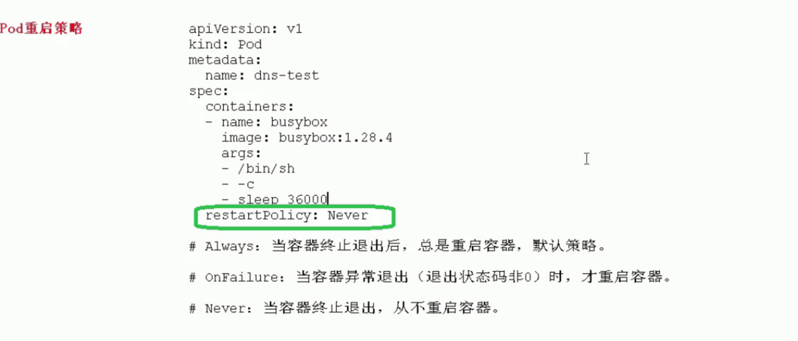

[TOC]

## 一、Pod的基本概念

​     Pod是k8s系统中可以创建和管理的最小单元，是资源对象模型中由用户创建或部署的最 小资源对象模型，也是在 k8s 上运行容器化应用的资源对象，其他的资源对象都是用来支 撑或者扩展 Pod 对象功能的，比如控制器对象是用来管控 Pod 对象的，Service 或者 Ingress 资源对象是用来暴露 Pod 引用对象的，PersistentVolume 资源对象是用来为 Pod 提供存储等等，k8s 不会直接处理容器，而是 Pod，Pod 是由一个或多个 container 组成

Pod 是 Kubernetes 的最重要概念，每一个 Pod 都有一个特殊的被称为”根容器“的 Pause 容器。Pause 容器对应的镜 像属于 Kubernetes 平台的一部分，除了 Pause 容器，每个 Pod 还包含一个或多个紧密相关的用户业务容器

+ 最小部署单元
+ pod里面可以包含多个容器(一组容器的集合)
+ 一个pod中容器共享网络命名空间
+ pod是短暂的


## 二、pod存在意义

- 创建容器使用docker ，一个docker对应是一个容器，一个容器有进程，一个容器运行一个运用程序
- pod是多进行设计，运行多个应用程序
  - 一个pod有多个容器，一个容器里面运行一个应用程序
- pod存在为了亲密性应用
  - 两个应用之间进行交互
  - 网络之间调用
  - 两个应用需要频繁调用

## 三、Pod的实现机制

### 3.1 共享网络

​	


**pod实现共享网络机制**：

+ 首先创建`Pause容器`也可以叫做`info容器`或者`根容器`
+ 再创建业务容器，每次创建业务容器都会加入到`info容器`里面，这样pod就在同一个`namespace`下面，这样就可以**网络共享**

### 3.2 共享存储


**pod实现共享存储机制**：

+ 引入`Volumn`数据卷的概念，使用数据卷进行持久化存储

## 四、Pod镜像拉取策略


**imagePullPolicy**

+ ifNotPresent:宿主机不存在则拉取
+ Always:每次创建pod都会重新拉取一次镜像
+ Never：pod永远都不糊主动拉取镜像

## 五、Pod资源限制


## 六、Pod重启机制



**restartPullPolicy**

+ Always：当容器终止退出后，总是重启容器，默认策略
+ onFailure: 当容器异常退出（退出状态码非0）时，才重启容器
+ Never：当容器终止退出，从不重启容器。

## 七、Pod健康检查


## 八、Pod调度策略-创建pod流程


**创建pod流程**

+ **createPod** 首先到`Api Server`创建`Pod`然后在etcd里面存储pod的信息
+ `Scheduler`会实时监控`Api Server`有没有新的`Pod`创建，如果发现有新的`Api Server`有新的Pod创建，通过`Api Server`读取`etcd`信息根据`调度算法`把读取出来pod调度到某个node上面,然后把最终的结果返回给api server然后存储在etcd中
+ **Node节点**通过`kubelet`到api server 读取etcd，查询分配给当前node的pod信息，然后通过docker把容器创建，创建之后把状态返回给api server，并且在etcd中进行存储

## 九、影响Pod调度


### 1.Pod的资源限制

```,
resources:
	requests:
		memory; "64Mi",
		cpu: "250m"
```

+ 根据request找到足够node节点进行调度

### 2.节点选择器标签

```
nodeSelector:
	env_role: dev
```


### 3.节点亲和性


+ 硬亲和性

  约束条件必须满足

+ 软亲和性

### 4.污点

#### (1)基本介绍

+ `nodeSelect`和`nodeAffinity`:Pod调度到某些节点上，**pod属性**，调度的时候实现
+ `Taint污点`：节点不做普通分配调度，是节点属性

#### (2)应用场景

+ 专用节点
+ 配置特点硬件节点
+ 基于Taint驱逐

#### (3)具体演示

+ 查看节点污点情况

  ```
  kubectl describe node k8smaster | grep Taint
  ```

+ 污点里面的值3个

  + NoSchedule: 表示这个节点一定不被调度
  + PreferNoSchedule:尽量不被调度
  + NoExecute:不会被调度，并且还会被驱逐Node已有的Pod

#### (4)节点添加污点

```
kubectl taint node [node主机名称] key=value:污点3个值
```

#### (5)节点删除污点

```
kubectl taint node [node主机名称] key:污点3个值 -
```

### 5.污点容忍

```
spec:
	tolerations:
	- key: "key" // 当初设置node的key
		opreator："Equl"
		value: "value"
		effect: "NoSchedule"
	
	containers:
	- name: webdemo
		image: nginx
	
```


