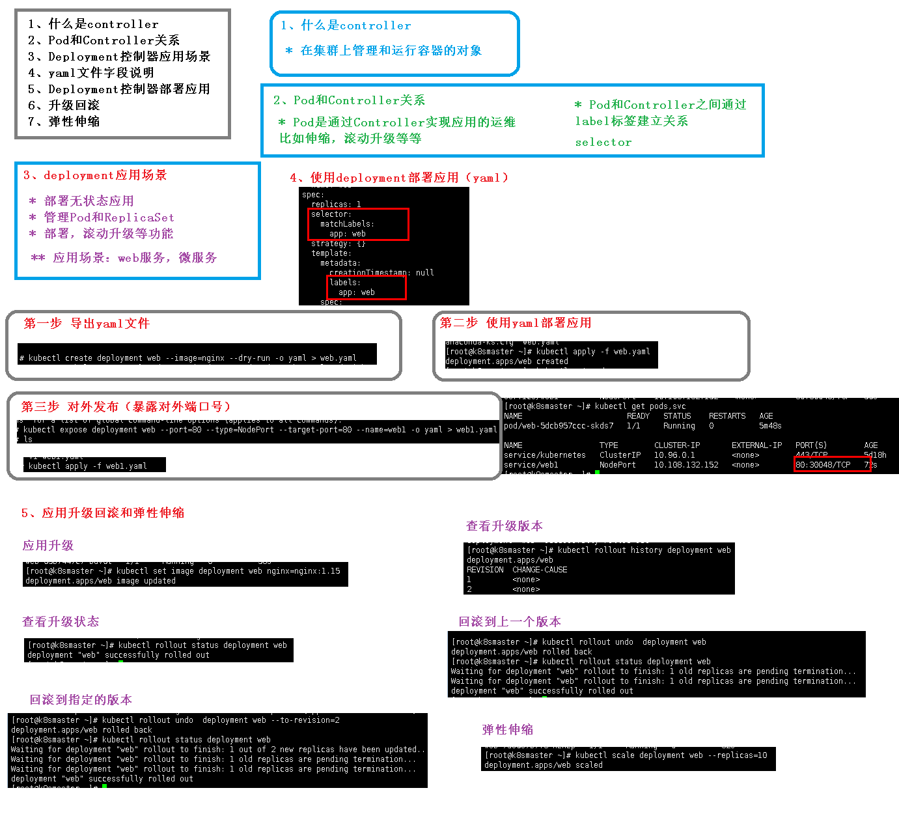
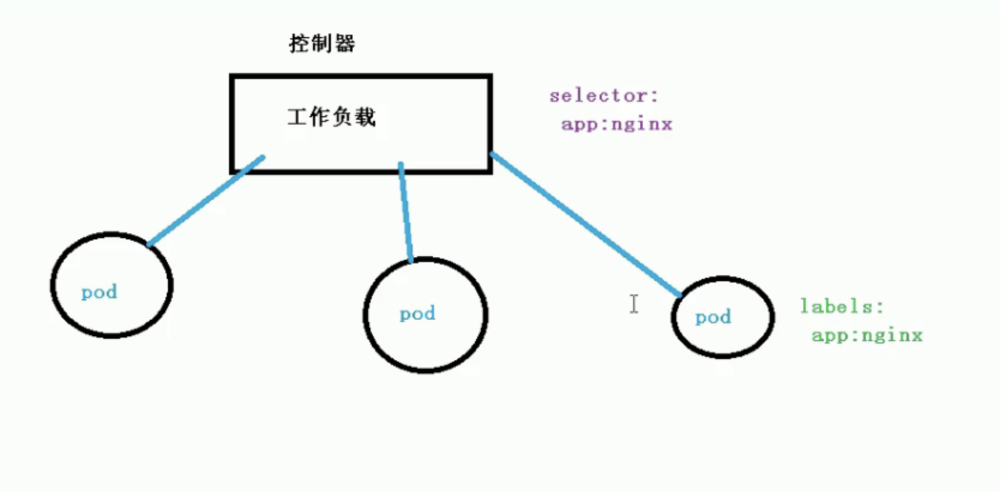

[TOC]



## 一、什么是Controller

+ 在集群上管理和运行容器的对象

## 二、Pod和Controller关系

+ Pod通过Controller实现应用的运维，比如伸缩，滚动升级等等
+ pod和Controller的关系建立是通过**label标签**和**selector选择器**


## 三、Deployment控制器应用场景

+ 部署无状态应用

+ 管理Pod和ReplicaSet

+ 部署，滚动升级等服务

```
应用场景：
	1、web服务
	2、微服务
```

## 四、yaml文件字段说明

```
apiVersion: apps/v1
kind: Deployment
metadata:
  creationTimestamp: null
  labels:
    app: web
  name: web
spec:
  replicas: 1
  selector:
    matchLabels:
      app: web
  strategy: {}
  template:
    metadata:
      creationTimestamp: null
      labels:
        app: web
    spec:
      containers:
      - image: nginx
        name: nginx
        resources: {}
status: {}
```


## 五、Deployment控制器部署应用

### 1.导出yaml文件

```
kubectl create deployment web --image=nginx --dry-run -o yaml > web.yaml
```

### 2.使用yaml文件部署

```
kubectl apply -f web.yaml
```

### 3.对外发布(暴露对外端口)

```
kubectl expose deployment web --port=80 --type=NodePort --target-port=80 --name=web1 -o yaml ->web1.yaml

kubectl apply -f web1.yaml
```

### 4.通过分配的ip访问

## 六、升级回滚


```
// 镜像版本升级
kubectl set image deployment web nginx=nginx:1.15

// 检查版本升级状态
kubectl rollout status deployment web

// 查看升级历史版本
kubectl rollout history deployment web

//还原成上一个版本
kubectl rollout undo deployment web

// 回滚到指定的版本
kubectl rollout undo deployment web --to-revision=3

```


## 七、弹性伸缩

```
kubectl scale deployment web --replicas=1
```


