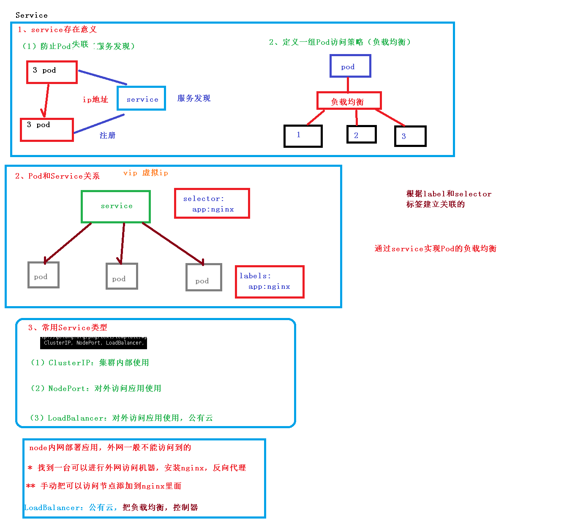

[TOC]

# Service



## 一、Service存在的意义

+ 防止Pod失联(服务发现)
+ 定义一组关于Pod访问策略(负载均衡)


## 二、Pod和Service关系

+ 通过Service实现pod的负载均衡
+ pod与Service通过label、select关联

## 三、常用Service类型

`ClusterIP`，`NodePort`, `Loadbalance`

### 1.ClusterIP

集群内部使用

### 2.Nodeport

对外应用访问

```
apiVersion: v1
kind: Service
metadata:
  creationTimestamp: null
  labels:
    app: web
  name: web3
spec:
  ports:
  - port: 80
    protocol: TCP
    targetPort: 80
  selector:
    app: web
  type: NodePort // 默认是ClusterIp ，可以修改成NodePort
status:
  loadBalancer: {}
```

### 3.LoadBalancer

对外访问应用使用，公有云


