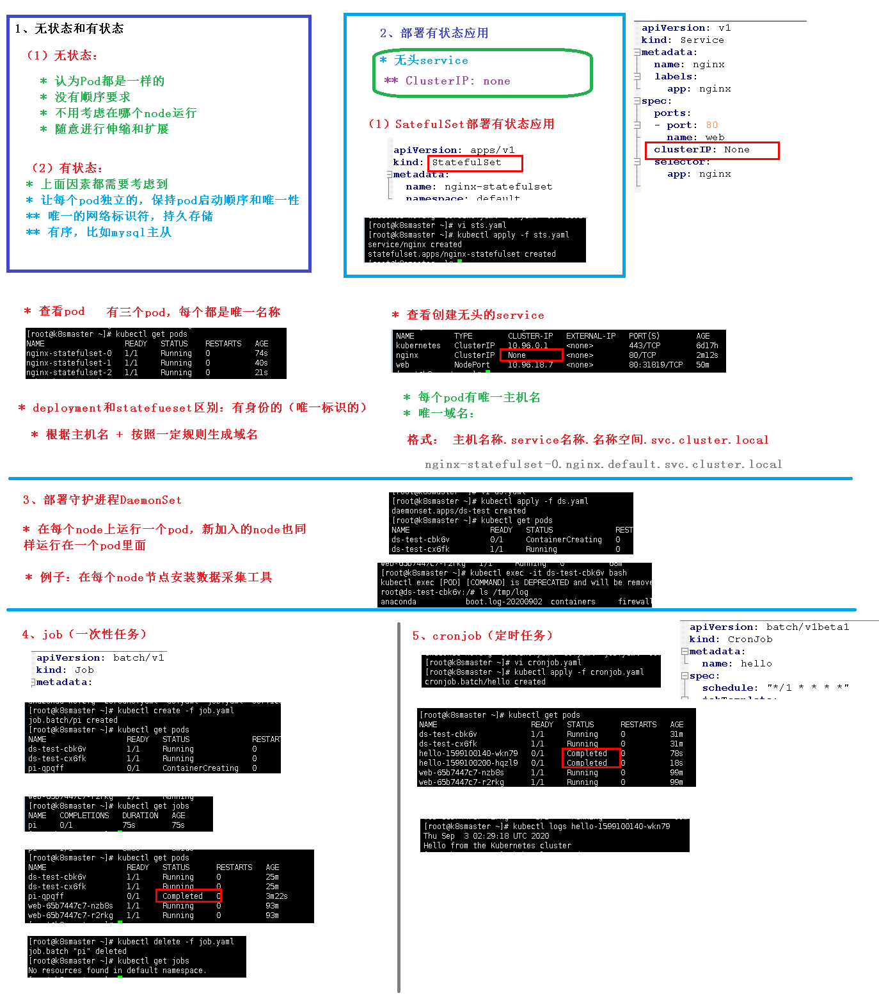

## 一、无状态和有状态

### 1.无状态特点

+ 认为Pod都是一样的
+ 没有顺序要求
+ 不用考虑在哪个node运行
+ 随意进行伸缩，扩展

### 2.有状态特点

+ 上面的因素都需要考虑到
+ 让每个pod都是`独立`的，保持pod启动顺序和`唯一性`
+ 通过唯一的`网络标识符`，`持久存储`
+ `有序`，比如mysql主从

## 二、部署有状态应用(SatefulSet)

+ 无头service

概念：**ClusterIp：none**

+ SatefulSet 

```
apiVersion: v1
kind: Service
metadata:
  name: nginx
  labels:
    app: nginx
spec:
  ports:
  - port: 80
    name: web
  clusterIP: None // 无头service
  selector:
    app: nginx

---

apiVersion: apps/v1
kind: StatefulSet
metadata:
  name: nginx-statefulset
  namespace: default
spec:
  serviceName: nginx
  replicas: 3
  selector:
    matchLabels:
      app: nginx
  template:
    metadata:
      labels:
        app: nginx
    spec:
      containers:
      - name: nginx
        image: nginx:latest
        ports:
        - containerPort: 80


```

+ deployment和statefulset区别：有身份的(唯一标识)
  + 根据主机名 + 按照一定规则生成域名
  + 每个pod有唯一主机名
  + 唯一域名 **格式`主机名称.service名称.名称空间.svc.cluster.local`**

## 三、部署守护进程(DaemonSet)

在每个node节点上运行同一个pod，新加入的node也是同样运行在一个pod里面

例如： 在每个node节点安装数据采集工具

**DaemonSet  yaml文件**

```
apiVersion: apps/v1
kind: DaemonSet
metadata:
  name: ds-test
  labels:
    app: filebeat
spec:
  selector:
    matchLabels:
      app: filebeat
  template:
    metadata:
      labels:
        app: filebeat
    spec:
      containers:
      - name: logs
        image: nginx
        ports:
        - containerPort: 80
        volumeMounts:
        - name: varlog
          mountPath: /tmp/log
      volumes:
      - name: varlog
        hostPath:
          path: /var/log
```

## 四、job(一次性任务)

```
apiVersion: batch/v1
kind: job
metadata:
  name: pi
spec:
  template:
    spec:
      containers:
      - name: pi
        image: perl
        command: ["perl","-Mbignum=bpi","-wle","print bpi(2000)"]
      restartPolicy: Never
  backoffLimit: 4 // 失败尝试
```


```
查看
kubectl get jobs
```


## 五、cornjob(定时任务)

```
apiVersion: batch/v1beta1
kind: CronJob
metadata:
  name: hello
spec:
  schedule: "*/1 * * * *"
  jobTemplate:
    spec:
      template:
        spec:
          containers:
          - name: hello
            image: busybox
            args:
            - /bin/sh
            - -c
            - date; echo Hello from the Kubernetes cluster
          restartPolicy: OnFailure
```

