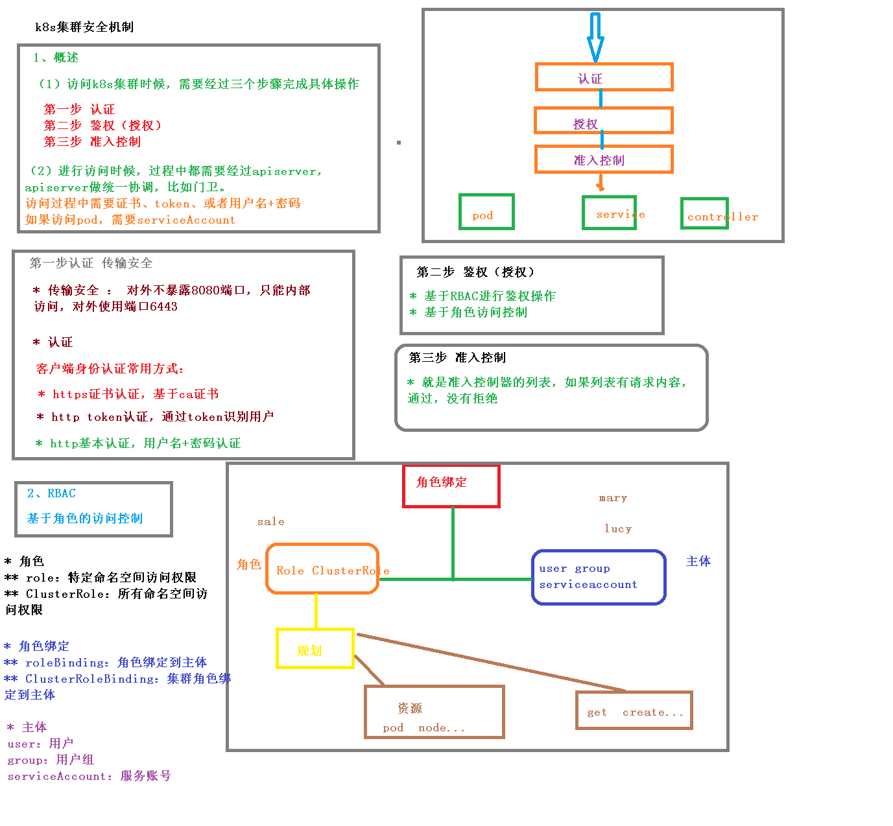

## 一、概述

### 1.访问k8s集群的时候，需要经过三个步骤完成具体操作

+ 第一步：**`认证`**
+ 第二步：**`鉴权(授权)`**
+ 第三步：`准入控制`

### 2.进入访问时候，过程找那个都需要经过`apiServer`,apiserver做统一协调控制

+ 访问过程中需要证书、token或者用户名+密码
+ 如果访问pod需要serviceAccount

### 3.第一步认证 传输安全

+ 传输安全：对外不能暴露8080端口，只能对内部访问，对外暴露6443
+ **认证**（客户端身份常用方式）
  + https证书认证，基于ca证书
  + http token认证，通过token识别用户
  + http基本认证，用户名+ 密码认证

### 4.第二部 鉴权(授权)

+ 基于**`RBAC(基于角色的访问控制`**进行鉴权操作
+ 基于角色访问控制

### 5.准入控制

+ 就是准入控制器的列表，如果列表有请求内容，通过，没有则拒绝


## 二、RBAC(基于角色的访问控制)介绍

+ 创建命名空间

```
// 创建新的命名空间
kubectl create namespace roledemo
```

+ 在新创建的命名空间创建pod

```
kubectl run nginx --image=nginx -n roledemo
```

+ 创建角色yaml

```
kind: Role
apiVersion: rbac.authorization.k8s.io/v1
metadata:
  namespace: roledemo
  name: pod-reader
rules:
- apiGroups: [""] # "" indicates the core Api group
  resources: ["pods"]
  verbs: ["get","watch","list"]
```

```
# 查看当前命名空间下面的角色
kubectl get roles -n roledemo
```

+ 创建角色绑定rolebinding.yaml

```
kind: RoleBinding
apiVersion: rbac.authorization.k8s.io/v1
metadata:
  name: read-pods
  namespace: roledemo
subjects:
- kind: User
  name: lucy
  apiGroup: rbac.authorization.k8s.io
roleRef:
  kind: Role
  name: pod-reader
  apiGroup: rbac.authorization.k8s.io
```

```
# 查询role
kubectl get role,rolebinding -n roledemo
```

+ 使用证书验证身份


