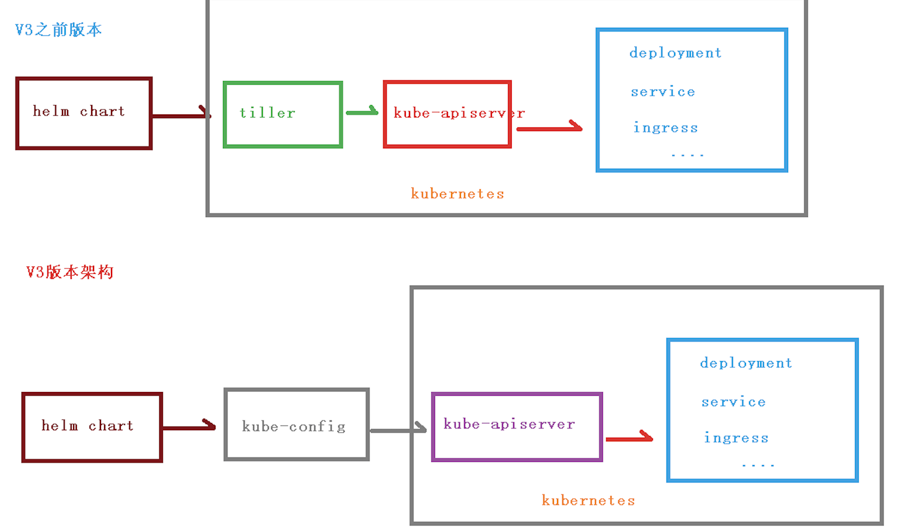

[TOC]

##  一、Helm引入

### 1、之前部署应用的基本过程

+ 编写yaml文件
  + deployment
  + Service
  + Ingress
+ 如果之前的方式部署单一应用，少数服务的应用，比较合适
+ 比如部署微服务项目，可能有几十个服务，每个服务都有一套yaml文件，需要维护大量yaml文件，版本管理也是特别不方便

### 2、使用helm可以解决哪些问题

+ 可以把这些yaml文件作为一个整体管理
+ 实现yaml文件高效复用
+ 实现应用级别的版本管理

## 二、Helm介绍

​		Helm是一个Kubernetes的**包管理工具**，就像Linux的包管理器。如yum/apt等，可以很方便的将之前打包好的yaml文件部署到kubernetes上面

### 1、**Helm有3个重要概念：**

#### （1）helm

​		一个命令行客户端工具，主要用于Kubernetes的应用chart的`创建`、`打包`、`发布`和`管理`

####  （2）Chart

​		`应用描述`，一系列用于描述k8s资源相关(yaml)文件的集合

#### （3）Release

​		基于Chart的部署`实体`，一个chart被Helm运行后将会生成对应的一个release;将在k8s中创建出真实运行的资源对象.应用级别的版本管理

### 2、Helm在2019年发布V3版本，和之前的版本相比有变化

#### （1）v3删除tiller

#### （2）release可以在不同命名空间中重用

#### （3）可以将chart推到docker镜像仓库中

 ### 3、Helm架构变化

 

## 三、Helm安装

### 1、步骤

+ 第一步; 下载helm安装压缩包，上传到linux系统
+ 第二部： 解压helm文件，把解压的helm目录复制到usr/bin目录下

### 2、配置helm仓库

+ 添加仓库

```
helm repo add 仓库名称 仓库地址
helm repo add stable http://mirror.azure.cn/kubernetes/charts

helm repo add stable	https://charts.helm.sh/stable
```

### 3、Helm快速部署应用

+ 第一步：使用命令搜索应用

```
helm search repo xxx名称(weave)
```

+ 第二部 根据搜索内容选择进行安装

```
# 安装
helm install 安装之后的名称 搜索之后应用名称

# 查看安装之后的状态
helm list
helm status 安装之后的名称
```

+ 修改service 的yaml

```
kubectl edit svc ui-weave-scope
```

## 四、如何自己创建Chart

### 1、使用命令创建chart

```
### 创建chart
helm create chartname
```

创建之后会有以下主要文件和目录

+ `Chart.yaml`:当前chart属性配置文件
+  `templates`:编写yaml文件放在这个目录
+ `values.yaml`：yaml文件可以使用全局变量

### 2、在template文件夹创建两个yaml文件

+ deployment.yaml
+ Service.yaml

### 3、安装mychart

```
helm insatll web1 mychart
```

### 4、应用升级

```
helml upgrade web1 mychart
```

## 五、chart模板

实现yaml高效复用，通过传递参数，动态渲染模板，yaml内容动态传入参数生成

在chart有`values.yaml`文件，定义yaml文件全局变量

### 1、yaml文件大体有集中不同的地方

+ image
+ tag
+ label
+ port
+ replicas

### 2、在template的yaml文件使用values.yaml定义变量

+ 通过表达式形式使用全局变量

```
{{.Values.变量名称}}
```

+ deploymet.yaml

```
apiVersion: apps/v1
kind: Deployment
metadata:
  creationTimestamp: null
  labels:
    app: web1
  name: {{.Release.Name}}-deploy
spec:
  replicas: 1
  selector:
    matchLabels:
      app: {{.Values.label}}
  strategy: {}
  template:
    metadata:
      creationTimestamp: null
      labels:
        app: {{.Values.label}}
    spec:
      containers:
      - image: {{.Values.image.repository}}
        name : nginx
        resources: {}
status: {}
```

+ Service.yaml

```
apiVersion: v1
kind: Service
metadata:
  creationTimestamp: null
  labels:
    app: {{.Values.label}}
  name: {{.Release.Name}}-svc
spec:
  ports:
  - port: {{.Values.service.port}}
    protocol: TCP
    targetPort: {{.Values.service.port}}
  selector:
    app: {{.Values.label}}
status:
  loadBalancer: {}
```

