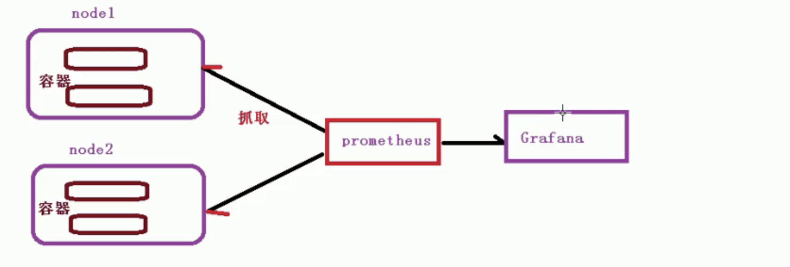

[TOC]

### 集群资源监控

### 一、监控指标

#### 1、集群监控

+ 节点资源利用率
+ 节点数
+ 运行pods

#### 2、Pod监控

+ 容器指标
+ 运用程序

### 二、监控平台搭建方案

`prometheus`+ `grafana`

#### 1、prometheus

+ 开源的
+ 监控、报警、数据库
+ 以`http`周期性抓取被监控组件状态
+ 不需要复杂的集成过程，使用http接口接入就可以了

#### 2、Granfana

+ 开源的数据分析和可视化工具
+ 支持多种数据源

### 三、架构



#### 四、实际搭建监控平台

#### 1、部署prometheus

##### （1）用daemonset方式部署 node-exporter 

```
# mkdir k8s-prometheus
# cd k8s-prometheus
# vim node-exporter.yaml
# cat node-exporter.yaml
---
apiVersion: apps/v1
kind: DaemonSet
metadata:
  name: node-exporter
  namespace: kube-system
  labels:
    k8s-app: node-exporter
spec:
  selector:
    matchLabels:
      k8s-app: node-exporter
  template:
    metadata:
      labels:
        k8s-app: node-exporter
    spec:
      containers:
      - image: prom/node-exporter
        name: node-exporter
        ports:
        - containerPort: 9100
          protocol: TCP
          name: http
---
apiVersion: v1
kind: Service
metadata:
  labels:
    k8s-app: node-exporter
  name: node-exporter
  namespace: kube-system
spec:
  ports:
  - name: http
    port: 9100
    nodePort: 31672
    protocol: TCP
  type: NodePort
  selector:
    k8s-app: node-exporter

# kubectl apply -f  node-exporter.yaml 
```

##### (2)prometheus-rbac

```
# vm rbac-setup.yaml
# cat rbac-setup.yaml
apiVersion: rbac.authorization.k8s.io/v1
kind: ClusterRole
metadata:
  name: prometheus
rules:
- apiGroups: [""]
  resources:
  - nodes
  - nodes/proxy
  - services
  - endpoints
  - pods
  verbs: ["get", "list", "watch"]
- apiGroups:
  - extensions
  resources:
  - ingresses
  verbs: ["get", "list", "watch"]
- nonResourceURLs: ["/metrics"]
  verbs: ["get"]
---
apiVersion: v1
kind: ServiceAccount
metadata:
  name: prometheus
  namespace: kube-system
---
apiVersion: rbac.authorization.k8s.io/v1
kind: ClusterRoleBinding
metadata:
  name: prometheus
roleRef:
  apiGroup: rbac.authorization.k8s.io
  kind: ClusterRole
  name: prometheus
subjects:
- kind: ServiceAccount
  name: prometheus
  namespace: kube-system

# kubectl apply -f  rbac-setup.yaml
```

#### (3)prometheus-deployment 

```
# vim prometheus.deploy.yml
# cat prometheus.deploy.yml
---
apiVersion: apps/v1
kind: Deployment
metadata:
  labels:
    name: prometheus-deployment
  name: prometheus
  namespace: kube-system
spec:
  replicas: 1
  selector:
    matchLabels:
      app: prometheus
  template:
    metadata:
      labels:
        app: prometheus
    spec:
      containers:
      - image: prom/prometheus:v2.0.0
        name: prometheus
        command:
        - "/bin/prometheus"
        args:
        - "--config.file=/etc/prometheus/prometheus.yml"
        - "--storage.tsdb.path=/prometheus"
        - "--storage.tsdb.retention=24h"
        ports:
        - containerPort: 9090
          protocol: TCP
        volumeMounts:
        - mountPath: "/prometheus"
          name: data
        - mountPath: "/etc/prometheus"
          name: config-volume
        resources:
          requests:
            cpu: 100m
            memory: 100Mi
          limits:
            cpu: 500m
            memory: 2500Mi
      serviceAccountName: prometheus    
      volumes:
      - name: data
        emptyDir: {}
      - name: config-volume
        configMap:
          name: prometheus-config   

# kubectl apply -f  prometheus.deploy.yml 
```

#### (4)Prometheus-service

```
# vim prometheus.svc.yml
# cat prometheus.svc.yml
---
kind: Service
apiVersion: v1
metadata:
  labels:
    app: prometheus
  name: prometheus
  namespace: kube-system
spec:
  type: NodePort
  ports:
  - port: 9090
    targetPort: 9090
    nodePort: 30003
  selector:
    app: prometheus

#kubectl apply -f prometheus.svc.yml 
```

### 2、部署Grafana
#### （1）grafana-deployment

```
# mkdir ../grafana
# cd ../grafana
# vim grafana-deploy.yaml
# cat grafana-deploy.yaml
apiVersion: apps/v1
kind: Deployment
metadata:
  name: grafana-core
  namespace: kube-system
  labels:
    app: grafana
    component: core
spec:
  replicas: 1
  selector:
    matchLabels:
      app: grafana
  template:
    metadata:
      labels:
        app: grafana
        component: core
    spec:
      containers:
      - image: grafana/grafana:4.2.0
        name: grafana-core
        imagePullPolicy: IfNotPresent
        # env:
        resources:
          # keep request = limit to keep this container in guaranteed class
          limits:
            cpu: 100m
            memory: 100Mi
          requests:
            cpu: 100m
            memory: 100Mi
        env:
          # The following env variables set up basic auth twith the default admin user and admin password.
          - name: GF_AUTH_BASIC_ENABLED
            value: "true"
          - name: GF_AUTH_ANONYMOUS_ENABLED
            value: "false"
          # - name: GF_AUTH_ANONYMOUS_ORG_ROLE
          #   value: Admin
          # does not really work, because of template variables in exported dashboards:
          # - name: GF_DASHBOARDS_JSON_ENABLED
          #   value: "true"
        readinessProbe:
          httpGet:
            path: /login
            port: 3000
          # initialDelaySeconds: 30
          # timeoutSeconds: 1
        volumeMounts:
        - name: grafana-persistent-storage
          mountPath: /var
      volumes:
      - name: grafana-persistent-storage
        emptyDir: {}

# kubectl apply -f grafana-deploy.yaml
```

#### （2）grafana-service

```
# vim grafana-svc.yaml
# cat grafana-svc.yaml
apiVersion: v1
kind: Service
metadata:
  name: grafana
  namespace: kube-system
  labels:
    app: grafana
    component: core
spec:
  type: NodePort
  ports:
    - port: 3000
  selector:
    app: grafana
    component: core

# kubectl apply -f grafana-svc.yaml
```

#### （3）grafana-ingress

```
# vim grafana-ing.yaml
# cat grafana-ing.yaml
apiVersion: extensions/v1beta1
kind: Ingress
metadata:
   name: grafana
   namespace: kube-system
spec:
   rules:
   - host: k8s.grafana
     http:
       paths:
       - path: /
         backend:
          serviceName: grafana
          servicePort: 3000

# kubectl apply -f grafana-ing.yaml
```

