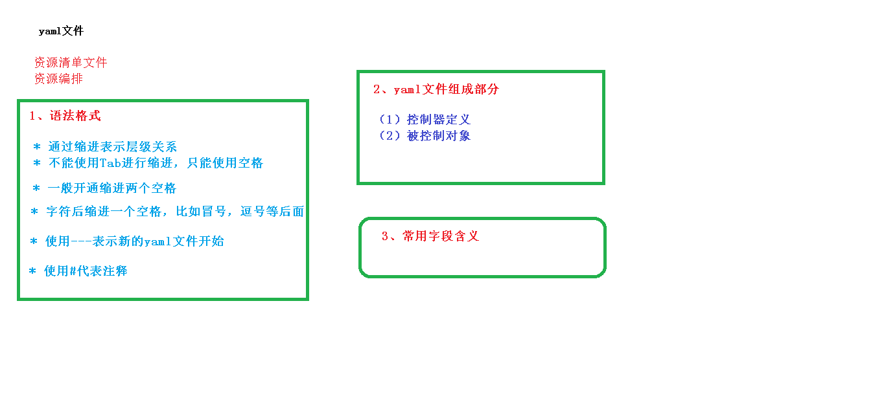
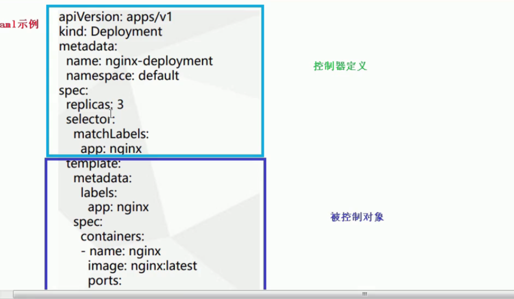
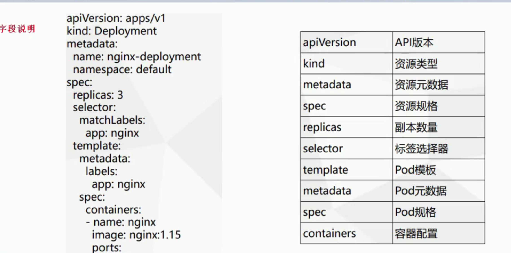

[TOC]

## 一、YAML文件概述

### 1.1 资源编排

k8s 集群中对资源管理和资源对象编排部署都可以通过声明样式(YAML)文件来解决，也 就是可以把需要对资源对象操作编辑到 YAML 格式文件中，我们把这种文件叫做`资源清单文件`，通过 kubectl 命令直接使用资源清单文件就可以实现对大量的资源对象进行编排部署 了。

## 二、YAML文件书写格式

### 2.1YAML介绍

 YAML :仍是一种标记语言。为了强调这种语言以数据做为中心，而不是以标记语言为重点。 YAML 是一个可读性高，用来表达数据序列的格式。

### 2.2YAML基本语法

+ 使用空格做为缩进
+ 缩进的空格数目不重要，只要相同层级的元素左侧对齐即可
+ 低版本缩进时不允许使用 Tab 键，只允许使用空格
+ 使用`#`标识注释，从这个字符一直到行尾，都会被解释器忽略
+ 使用`---`表示新的yaml文件开始

### 2.3YAML 支持的数据结构

## 三、yaml文件的组成部分

+ 控制器定义
+ 被控制对象

## 四、常用字段含义

