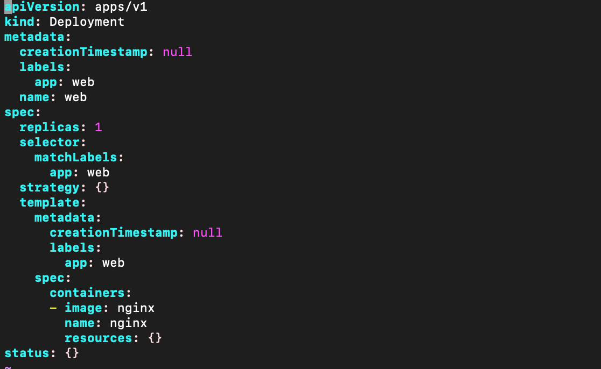

[Toc]

## 如何快速编写yaml文件

### 第一种:使用kubectl create 命令生成yaml文件

```
kubectl create deployment web --image=nginx -o yaml --dry-run >m1.yaml
```



### 第二种:使用kuberctl get 命令到处yaml文件

```
kubectl get deploy nginx -o=yaml --export>m2.yaml
```

