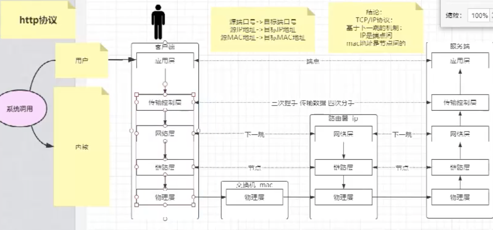
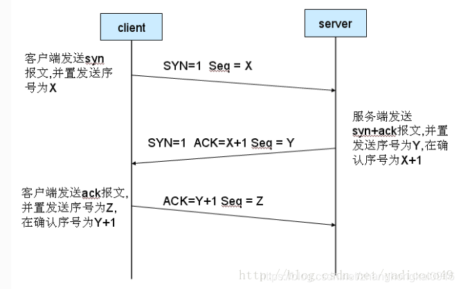

[TOC]

## 一、OSI 7层参考模型

​		OSI是一个[开放性](https://baike.baidu.com/item/开放性/3129237)的通信系统互连参考模型，它是一个定义得非常好的协议规范。


**应用层、表示层、会话层、传输控制层、网络层、链路层、物理层**


## 二、HTTP协议



```
netstat命令用于显示与IP、TCP、UDP和ICMP协议相关的统计数据,一般用于检验本机各端口的网络连接情况

// 创建一个socket 通信
exec 5<> /dev/tcp/www.baidu.com

// 发送(用户协议实现) -->实现应用成协议
echo -e "GET / HTTP/1.1 \n" >&5

// 接收(读取)
cat <&5

```

## 三、http各个层协议

### 1、什么是tcp和UDP

**TCP**

+ 面向`连接`的
+ `可靠`的传出协议

**UDP**

+ 不可靠的

### 2、三次握手-连接




`ISN`:初始化序列号

`ACK`:TCP报头的控制为，对数据进行确认由目的端发出，用来告诉发送端这个序列号之前的数据段都收到了。比如，确认好为X，则表示X-1个个数据段都收到了，只有当ACK=1时，确认号才有效，当ACK=0时，确认号无效，这时候会要求重传数据，保证数据的完整性

`SYN`:请求建立连接，称为请求同步报文

**三次握手过程**

+ 第一次握手：客户端给服务端发送一个`SYN`,指定客户端的初始化序列号`ISN`，此时的客户端处于`SYN_SEND`状态
+ 第二次握手：服务端收到客户端的`SYN`报文后，会以自己的`SYN`报文作为应答，并且也是指定自己的序列化号

`ISN`,同时会把客户端`ISN+1`作为`ACK`的值，表示自己已经接收到了客户端的SYN，此时服务器处于`SYN_REVD`状态

+ 第三次握手：客户端接收`SYN`报文，发送`ACK`报文，当然ack的值是`ISN+1`表示已经收到服务端的syn报文，此时客户端处于`establised`
+ 服务器收到`ACK`之后，也处于`establised`


### 3、四次挥手


+ 第一次分手：Client端发起中断连接请求，也就是发送`FIN`报文发送给服务端,告诉客户端"我已经没有数据需要给你了，"
+ 第二次分手：服务端接收到`FIN`,但是我们还没有准备好，所以先发送`ACK`告诉客户端"你的请求我已经收到，但是我还没有准备好"，Client端就进入`FIN_WAIT`状态
+ 第三次分手：当服务端的确认数据已经发送完成，向客户端发送`FIN`报文，"告诉客户端，好了，我这边的数据了，准备关闭连接了"
+ 第四次分手：Clienth收到`FIN`报文，知道可以关闭连接了。但是他不相信网络，怕Server不知道要关闭连接，发送`ACK`进入`TIME_WAIT`状态，如果Server接收到Ack则可以关闭连接，Client等待2ML后依然没有收到恢复，则证明Server端已经正常关闭

