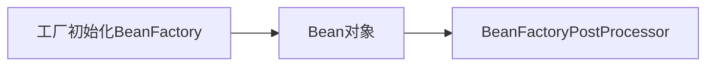

# 1、lazy-init 延迟加载

> ApplicationContext 容器的默认行为是在启动服务器时将所有 singleton bean 提前进行实例化。提前 实例化意味着作为初始化过程的一部分，ApplicationContext 实例会创建并配置所有的singleton bean。	

``` xml
<bean id="testBean" class="cn.lagou.LazyBean" />
该bean默认的设置为:
<bean id="testBean" calss="cn.lagou.LazyBean" lazy-init="false" />
```

注解模式

```  java
@Lazy
@Repository("accountDao")
public class JdbcAccountDaoImpl implements AccountDao {
  
}
```

## 全局的bean 配置懒加载

``` xml
<beans default-lazy-init="true">
    <!-- no beans will be eagerly pre-instantiated... -->
</beans>
```

## 应用场景

+ 开启延迟加载一定程度提高容器启动和运转性能
+ 对于不常使用的 Bean 设置延迟加载，这样偶尔使用的时候再加载，不必要从一开始该 Bean 就占 用资源

# 2、FactoryBean 和BeanFactory

+ BeanFactory接口是容器的顶级接口，定义了容器的一些基础行为，负责生产和管理Bean的一个工厂，

  具体使用它下面的子接口类型，比如ApplicationContext;此处我们重点分析FactoryBean

+ Spring中Bean有两种，一种是普通Bean，一种是工厂Bean(FactoryBean)，FactoryBean可以生成

  某一个类型的Bean实例(返回给我们)，也就是说我们可以借助于它自定义Bean的创建过程

``` java
// 可以让我们自定义Bean的创建过程(完成复杂Bean的定义) public interface FactoryBean<T> {
@Nullable
// 返回FactoryBean创建的Bean实例，如果isSingleton返回true，则该实例会放到Spring容器 的单例对象缓存池中Map
  T getObject() throws Exception;
@Nullable
// 返回FactoryBean创建的Bean类型 Class<?> getObjectType();
// 返回作用域是否单例
default boolean isSingleton() {
    return true;
  }
}
```

## 自定义FactorBean


``` java
public class Company {

    private String name;
    private String address;
    private int scale;
}

@Component
public class CompanyFactoryBean implements FactoryBean<Company> {


    private String companyInfo = "拉勾,中关村,500";

    @Override
    public Company getObject() throws Exception {

        // 模拟创建复杂对象Company
        Company company = new Company();
        String[] strings = companyInfo.split(",");
        company.setName(strings[0]);
        company.setAddress(strings[1]);
        company.setScale(Integer.parseInt(strings[2]));
        return company;
    }

    @Override
    public Class<?> getObjectType() {
        return Company.class;
    }

    @Override
    public boolean isSingleton() {
        return FactoryBean.super.isSingleton();
    }
}

```

测试

``` java
final Object Object = context.getBean("companyFactoryBean");
// // 结果如下
bean:Company{name='拉勾', address='中关村', scale=500}
```

获取FactoryBean，需要在id之前添加“&”

``` jav
final Object Object = context.getBean("&companyFactoryBean");
// // 结果如下
com.wuzx.transfer.factory.CompanyFactoryBean@18e36d14
```

## 一些复杂bean的创建一般就会使用FactoryBean

# 3、后置处理器

Spring提供了两种后处理bean的扩展接口，分别为 `BeanPostProcessor `和`BeanFactoryPostProcessor`，两者在使用上是有所区别的



> 工厂初始化(BeanFactory)—> Bean对象
>
> 在BeanFactory初始化之后可以使用BeanFactoryPostProcessor进行后置处理做一些事情
>
> 在Bean对象实例化(并不是Bean的整个生命周期完成)之后可以使用BeanPostProcessor进行后置处 理做一些事情
>
> 注意:对象不一定是springbean，而springbean一定是个对象


