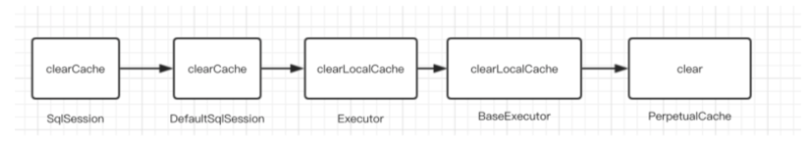

[TOC]

# 一、MyBatis的映射文件的概述	


# 二、MyBatis**常用配置解析

## 1.**environments**标签


> + 事务管理器(transactionManager)类型有两种:
>   + JDBC:这个配置就是直接使用了JDBC 的提交和回滚设置，它依赖于从数据源得到的连接来管理事务作用域。
>   + MANAGED:这个配置几乎没做什么。它从来不提交或回滚一个连接，而是让容器来管理事务的整个生 命周期(比如 JEE 应用服务器的上下文)。 默认情况下它会关闭连接，然而一些容器并不希望这样，因 此需要将 closeConnection 属性设置为 false 来阻止它默认的关闭行为。
> + 数据源(dataSource)类型有三种:
>   + UNPOOLED:这个数据源的实现只是每次被请求时打开和关闭连接。 
>   + POOLED:这种数据源的实现利用“池”的概念将 JDBC 连接对象组织起来
>   + JNDI:这个数据源的实现是为了能在如 EJB 或应用服务器这类容器中使用，容器可以集中或在外部配 置数据源，然后放置一个 JNDI 上下文的引用

## 2.**mapper**标签

该标签的作用是加载映射的，加载方式有如下几种:

``` xml-dtd
•使用相对于类路径的资源引用，例如:
<mapper resource="org/mybatis/builder/AuthorMapper.xml"/>
•使用完全限定资源定位符(URL)，例如:
<mapper url="file:///var/mappers/AuthorMapper.xml"/> 
•使用映射器接口实现类的完全限定类名，例如:
<mapper class="org.mybatis.builder.AuthorMapper"/> 
•将包内的映射器接口实现全部注册为映射器，例如:
<package name="org.mybatis.builder"/>
```

## 3.**Properties**标签

实际开发中，习惯将数据源的配置信息单独抽取成一个properties文件，该标签可以加载额外配置的properties文件


## 4.**typeAliases**标签

类型别名是为Java 类型设置一个短的名字。原来的类型名称配置如下


配置typeAliases，为com.lagou.domain.User定义别名为user


```xml-dtd
批量取别名
<!--给实体类的全限定名给别名-->
<typeAliases>
  <!-- 给单个实体类取别名 -->
  <!--  <typeAlias type="com.wuzx.pojo.User" alias="xxuser"></typeAlias>-->
  <!--批量取别名 ,别名就是类型，别名不区分大小写-->
  <package name="com.wuzx.pojo"/>
</typeAliases>
```


上面我们是自定义的别名，mybatis框架已经为我们设置好的一些常用的类型的别名


# 三、MyBatis复杂映射

实现复杂关系映射之前我们可以在映射文件中通过配置来实现，使用注解开发后，我们可以使用 @Results注解，@Result注解，@One注解，@Many注解组合完成复杂关系的配置


##   一对一查询

``` java

public interface OrderMapper {
    @Select("select * from orders")
    @Results({
            @Result(id=true,property = "id",column = "id"),
            @Result(property = "ordertime",column = "ordertime"),
            @Result(property = "total",column = "total"),
            @Result(property = "user",column = "uid",
                    javaType = User.class,
                    one = @One(select =
"com.lagou.mapper.UserMapper.findById"))
})
    List<Order> findAll();
}
```

## 一对多查询

``` java
 
public interface UserMapper {
    @Select("select * from user")
    @Results({
            @Result(id = true,property = "id",column = "id"),
            @Result(property = "username",column = "username"),
            @Result(property = "password",column = "password"),
            @Result(property = "birthday",column = "birthday"),
            @Result(property = "orderList",column = "id",
                    javaType = List.class,
                    many = @Many(select =
"com.lagou.mapper.OrderMapper.findByUid"))
})
    List<User> findAllUserAndOrder();
}
public interface OrderMapper {
    @Select("select * from orders where uid=#{uid}")
    List<Order> findByUid(int uid);
}
```

## 多对多查询

``` java
 
public interface UserMapper {
    @Select("select * from user")
    @Results({
        @Result(id = true,property = "id",column = "id"),
        @Result(property = "username",column = "username"),
        @Result(property = "password",column = "password"),
        @Result(property = "birthday",column = "birthday"),
        @Result(property = "roleList",column = "id",
                javaType = List.class,
                many = @Many(select =
"com.lagou.mapper.RoleMapper.findByUid"))
})
List<User> findAllUserAndRole();}
public interface RoleMapper {
    @Select("select * from role r,user_role ur where r.id=ur.role_id and
ur.user_id=#{uid}")
    List<Role> findByUid(int uid);
}
```


# 四、**Mybatis**缓存

 缓存就是内存中的数据，常常来自对数据库中查询结果的保存，使用缓存，我们可以避免频繁与数据库进行交互，进而提高响应速度

mybatis也提供了对缓存的支持，分为`一级缓存`和`二级缓存`


+ 一级缓存是SqlSession缓存。在操作数据库时需要构造sqlSession对象。在对象中有一个数据结构`（HashMap）`用于存储缓存数据。不同的sqlSession之间的缓存区域（HashMap）是互不影响的
+ 二级缓存mapper级别的缓存，多个SqlSession去操作同一个Mapper的sql语句，多个sqlsession可以公用二级缓存，二级缓存是跨SqlSession的。 

## 一级缓存


> 1、第一次发起查询用户id为1的用户信息，先去找缓存中是否有id为1的用户信息，如果没有，从 数据
>
> 库查询用户信息。得到用户信息，将用户信息存储到一级缓存中。
>
> 2、 如果中间sqlSession去执行commit操作(执行插入、更新、删除)，则会清空SqlSession中的 一 级缓存，这样做的目的为了让缓存中存储的是最新的信息，避免脏读。
>
> 3、 第二次发起查询用户id为1的用户信息，先去找缓存中是否有id为1的用户信息，缓存中有，直 接从 缓存中获取用户信息

### 一级缓存原理探究与源码分析


调研了一圈，发现上述所有方法中，好像只有clearCache()和缓存沾点关系，那么就直接从这个方 法入 手吧，分析源码时，我们要看它**(**此类**)**是谁，它的父类和子类分别又是谁，对如上关系了解了，你才 会 对这个类有更深的认识，分析了一圈，你可能会得到如下这个流程图



再深入分析，流程走到**Perpetualcache**中的clear()方法之后，会调用其**cache.clear()**方法，那 么这个 cache是什么东⻄呢?点进去发现，cache其实就是private Map cache = new

HashMap();也就是一个Map，所以说cache.clear()其实就是map.clear()，也就是说，缓存其实就是 本地存放的一个map对象，每一个SqISession都会存放一个map对象的引用，那么这个cache是何 时创 建的呢

你觉得最有可能创建缓存的地方是哪里呢?我觉得是**Executor**，为什么这么认为?因为Executor是 执 行器，用来执行SQL请求，而且清除缓存的方法也在Executor中执行，所以很可能缓存的创建也很 有可 能在Executor中，看了一圈发现Executor中有一个createCacheKey方法，这个方法很像是创 建缓存的 方法啊，跟进去看看，你发现createCacheKey方法是由BaseExecutor执行的，代码如下

``` jav
CacheKey cacheKey = new CacheKey();
 
//MappedStatement 的 id
// id就是Sql语句的所在位置包名+类名+ SQL名称 cacheKey.update(ms.getId());
// offset 就是 0
cacheKey.update(rowBounds.getOffset());
// limit 就是 Integer.MAXVALUE cacheKey.update(rowBounds.getLimit());
//具体的SQL语句
cacheKey.update(boundSql.getSql());
//后面是update 了 sql中带的参数
cacheKey.update(value);
...
if (configuration.getEnvironment() != null) {
// issue #176 cacheKey.update(configuration.getEnvironment().getId()); 
}
```

缓存到底用在

``` java
 
Override
public <E> List<E> query(MappedStatement ms, Object parameter, RowBounds
rowBounds, ResultHandler resultHandler) throws SQLException {
BoundSql boundSql = ms.getBoundSql(parameter);
//创建缓存
CacheKey key = createCacheKey(ms, parameter, rowBounds, boundSql); return query(ms, parameter, rowBounds, resultHandler, key, boundSql);
}
@SuppressWarnings("unchecked")
Override
public <E> List<E> query(MappedStatement ms, Object parameter, RowBounds
rowBounds, ResultHandler resultHandler, CacheKey key,  BoundSql boundSql)
throws SQLException {
...
  list = resultHandler == null ? (List<E>) localCache.getObject(key) : null;
if (list != null) {
//这个主要是处理存储过程用的。
handleLocallyCachedOutputParameters(ms, key, parameter, boundSql);
} else {
list = queryFromDatabase(ms, parameter, rowBounds, resultHandler, key,
boundSql); }
... }
// queryFromDatabase 方法
private <E> List<E> queryFromDatabase(MappedStatement ms, Object parameter, RowBounds rowBounds, ResultHandler resultHandler, CacheKey key, BoundSql boundSql) throws SQLException {
List<E> list; 
localCache.putObject(key, EXECUTION_PLACEHOLDER);
  try {
    list = doQuery(ms, parameter, rowBounds, resultHandler, boundSql);
  } finally {
    localCache.removeObject(key);
  }
  localCache.putObject(key, list);
  if (ms.getStatementType() == StatementType.CALLABLE) {
localOutputParameterCache.putObject(key, parameter);
    }
  return list;
}
```


## 二级缓存


### 二级缓存默认不开启(需要手动开启)，如何开启二级缓存


> 首先在全局配置文件sqlMapConfig.xml文件中加入如下代码:
>
> ```xml-dtd
> <!--开启二级缓存--> 
> <settings>
> 	<setting name="cacheEnabled" value="true"/>
> </settings>
> ```
>
> 其次在UserMapper.xml文件中开启缓存
>
> ``` xml
> <!--开启二级缓存--> <cache></cache>
> ```
>
> 我们可以看到mapper.xml文件中就这么一个空标签，其实这里可以配置,PerpetualCache这个类是 mybatis默认实现缓存功能的类。我们不写type就使用mybatis默认的缓存，也可以去实现Cache接口 来自定义缓存
>
> 开启了二级缓存后，还需要将要缓存的pojo实现Serializable接口，为了将缓存数据取出执行反序列化操 作，因为二级缓存数据存储介质多种多样，不一定只存在内存中，有可能存在硬盘中，如果我们要再取 这个缓存的话，就需要反序列化了。所以mybatis中的pojo都去实现Serializable接

### **useCache**和**flushCache**

mybatis中还可以配置userCache和flushCache等配置项，userCache是用来设置是否禁用二级缓 存 的，在statement中设置useCache=false可以禁用当前select语句的二级缓存，即每次查询都会发出 sql 去查询，默认情况是true,即该sql使用二级缓存

``` xml
<select id="selectUserByUserId" useCache="false"
resultType="com.lagou.pojo.User" parameterType="int">
  select * from user where id=#{id}
</select>
```

设置statement配置中的flushCache="true”属性，默认情况下为true,即刷新缓存，如果改成false则 不 会刷新。使用缓存时如果手动修改数据库表中的查询数据会出现脏读。

``` xml
 <select id="selectUserByUserId" flushCache="true" useCache="false"
resultType="com.lagou.pojo.User" parameterType="int">
  select * from user where id=#{id}
</select>
```

一般下执行完commit操作都需要刷新缓存，flushCache=true表示刷新缓存，这样可以避免数据库脏 读。所以我们不用设置，默认即可

### 二级缓存整合**redis**

pom依赖

``` xml
<dependency>
  <groupId>org.mybatis.caches</groupId>
  <artifactId>mybatis-redis</artifactId>
  <version>1.0.0-beta2</version>
</dependency>
```

#### 配置文件设置

``` xml
 
<?xml version="1.0" encoding="UTF-8"?>
<!DOCTYPE mapper PUBLIC "-//mybatis.org//DTD Mapper 3.0//EN"
"http://mybatis.org/dtd/mybatis-3-mapper.dtd">
<mapper namespace="com.lagou.mapper.IUserMapper">
<cache type="org.mybatis.caches.redis.RedisCache" />
<select id="findAll" resultType="com.lagou.pojo.User" useCache="true">
  select * from user
</select>
```

#### mapper接口设置

``` java
@CacheNamespace(implementation = RedisCache.class) // 开启二级缓存
public interface IUserMapper {}
```

#### 生成 redis.properties

```
redis.host=localhost
redis.port=6379
redis.connectionTimeout=5000
redis.password=
redis.database=0
```

# 五、**Mybatis**插件

## 1.插件简介

> 一般情况下，开源框架都会提供插件或其他形式的拓展点，供开发者自行拓展。这样的好处是显而易⻅ 的，一是增加了框架的灵活性。二是开发者可以结合实际需求，对框架进行拓展，使其能够更好的工 作。以MyBatis为例，我们可基于MyBati s插件机制实现分⻚、分表，监控等功能。由于插件和业务 无 关，业务也无法感知插件的存在。因此可以无感植入插件，在无形中增强功能

## 2.**Mybatis**插件介绍

Mybati s作为一个应用广泛的优秀的ORM开源框架，这个框架具有强大的灵活性，在四大组件

(Executor、StatementHandler、ParameterHandler、ResultSetHandler)处提供了简单易用的插 件扩 展机制。Mybatis对持久层的操作就是借助于四大核心对象。MyBatis支持用插件对四大核心对象进 行 拦截，对mybatis来说插件就是拦截器，用来增强核心对象的功能，增强功能本质上是借助于底层的 动 态代理实现的，换句话说，MyBatis中的四大对象都是代理对象


### **MyBatis**所允许拦截的方法如下:

+ 执行器Executor (update、query、commit、rollback等方法); 
+ SQL语法构建器StatementHandler (prepare、parameterize、batch、updates query等方 法); 
+ 参数处理器ParameterHandler (getParameterObject、setParameters方法); 
+ 结果集处理器ResultSetHandler (handleResultSets、handleOutputParameters等方法);

### **Mybatis**插件原理

> 在四大对象创建的时候
>
> 1、每个创建出来的对象不是直接返回的，而是interceptorChain.pluginAll(parameterHandler); 
>
> 2、获取到所有的Interceptor (拦截器)(插件需要实现的接口);调用 interceptor.plugin(target);返 回 target 包装后的对象
>  3、插件机制，我们可以使用插件为目标对象创建一个代理对象;AOP (面向切面)我们的插件可 以 为四大对象创建出代理对象，代理对象就可以拦截到四大对象的每一个执行

插件具体是如何拦截并附加额外的功能的呢?以ParameterHandler来说

``` java
 
public ParameterHandler newParameterHandler(MappedStatement mappedStatement,
Object object, BoundSql sql, InterceptorChain interceptorChain){
    ParameterHandler parameterHandler =
mappedStatement.getLang().createParameterHandler(mappedStatement,object,sql);
  parameterHandler = (ParameterHandler)
  interceptorChain.pluginAll(parameterHandler);
  return parameterHandler;
}
public Object pluginAll(Object target) {
  for (Interceptor interceptor : interceptors) {
    target = interceptor.plugin(target);
}
  return target;
}
```

interceptorChain保存了所有的拦截器(interceptors)，是mybatis初始化的时候创建的。调用拦截器链 中的拦截器依次的对目标进行拦截或增强。interceptor.plugin(target)中的target就可以理解为mybatis 中的四大对象。返回的target是被重重代理后的对象

如果我们想要拦截Executor的query方法，那么可以这样定义插件:

``` java
 @Intercepts({
  @Signature(
    type = Executor.class,
    method = "query",
    args=
{MappedStatement.class,Object.class,RowBounds.class,ResultHandler.class}
    )
})
public class ExeunplePlugin implements Interceptor {
//省略逻辑 }
```

除此之外，我们还需将插件配置到sqlMapConfig.xm l中。

``` xml
 <plugins>
  <plugin interceptor="com.lagou.plugin.ExamplePlugin">
  </plugin>
</plugins>
```

## 自定义插件

+ Mybatis 插件接口-Interceptor
+ • Intercept方法，插件的核心方法
   • plugin方法，生成target的代理对象
   • setProperties方法，传递插件所需参数


``` java
package com.wuzx.plugin;

import org.apache.ibatis.executor.statement.StatementHandler;
import org.apache.ibatis.plugin.*;

import java.sql.Connection;
import java.util.Properties;


@Intercepts({
        @Signature(type = StatementHandler.class,//这是指拦截哪个接口
                   method = "prepare", //这个接口内的哪个方法名
                   args = {Connection.class, Integer.class}//// 这是拦截的方法的入参，按
顺序写到这，不要多也不要少，如果方法重载，可是要通过方法名和入参来确定唯一的
                  )

})
public class MyPlugin implements Interceptor {


    /**
     * 拦截方法，只要被拦截的目标对象的目标方法被执行时，每次都会执行intercept方法
     *
     * @param invocation
     * @return
     * @throws Throwable
     */
    @Override
    public Object intercept(Invocation invocation) throws Throwable {
        System.out.println("对方法进行了增强，，，，");
        return invocation.proceed(); //让原方法执行
    }

    /**
     * 主要为了把当前拦截器生成代理对象存到拦截器链里面
     *
     * @param target
     * @return
     */
    @Override
    public Object plugin(Object target) {
        final Object wrap = Plugin.wrap(target, this);
        return wrap;
    }

    /**
     * 获取配置文件的参数
     *
     * @param properties
     */
    @Override
    public void setProperties(Properties properties) {
        System.out.println("获取到的配置文件参数：" + properties);
    }
}

```

## 核心配置文件注入插件 sqlMapConfig.xml

``` xml
 <plugins>
  <plugin interceptor="com.lagou.plugin.MySqlPagingPlugin">
<!--配置参数-->
    <property name="name" value="Bob"/>
  </plugin>
</plugins>
```

### 插件源码分析

Plugin实现了 InvocationHandler接口，因此它的invoke方法会拦截所有的方法调用。invoke方法会 对 所拦截的方法进行检测，以决定是否执行插件逻辑。该方法的逻辑如下:

``` java
 
// -Plugin
    public Object invoke(Object proxy, Method method, Object[] args) throws
Throwable {
try { /*
commit]
*获取被拦截方法列表，比如:
* signatureMap.get(Executor.class), 可能返回 [query, update,
*/
            Set<Method> methods =
signatureMap.get(method.getDeclaringClass());
args));
//检测方法列表是否包含被拦截的方法
if (methods != null && methods.contains(method)) {
//执行插件逻辑
return interceptor.intercept(new Invocation(target, method,
//执行被拦截的方法
    return method.invoke(target, args);
} catch(Exception e){
} }
```

# 六、通用 **mapper**

什么是通用**Mapper**

通用Mapper就是为了解决单表增删改查，基于Mybatis的插件机制。开发人员不需要编写SQL,不需要 在DAO中增加方法，只要写好实体类，就能支持相应的增删改查方法

### 依赖

``` xml
 <dependency>
  <groupId>tk.mybatis</groupId>
  <artifactId>mapper</artifactId>
  <version>3.1.2</version>
</dependency>
```

## Mybatis配置文件中完成配置

``` xml
 
<plugins>
<!--分⻚插件:如果有分⻚插件，要排在通用mapper之前-->
<plugin interceptor="com.github.pagehelper.PageHelper">
      <property name="dialect" value="mysql"/>
  </plugin>
<plugin interceptor="tk.mybatis.mapper.mapperhelper.MapperInterceptor"> <!-- 通用Mapper接口，多个通用接口用逗号隔开 -->
<property name="mappers" value="tk.mybatis.mapper.common.Mapper"/>
  </plugin>
</plugins>
```

