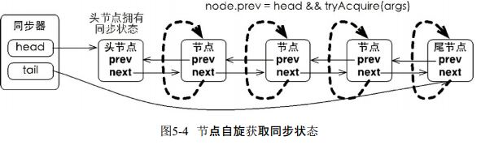
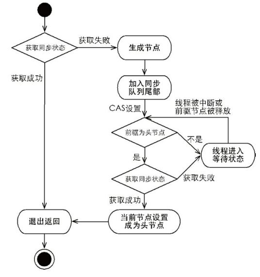
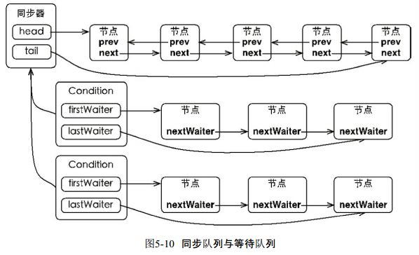

## AQS-AbstractQueuedSynchronized

### 控制量是WaitStates，节点的状态值

```
/** waitStatus value to indicate thread has cancelled */
static final int CANCELLED =  1;   //该节点被取消了
/** waitStatus value to indicate successor's thread needs unparking */
static final int SIGNAL    = -1;   //该节点后续节点需要被唤醒
/** waitStatus value to indicate thread is waiting on condition */
static final int CONDITION = -2;  //该节点进入了等待队列，即Condition的队列里
/**
 * waitStatus value to indicate the next acquireShared should
 * unconditionally propagate
 */
static final int PROPAGATE = -3;  //共享节点，该节点进锁后会释放锁，。
```


## AQS流程图









源码分析：核心方法 aquaire和release及他们方法体里使用到的方法。

```
public final void acquire(int arg) {
        if (!tryAcquire(arg) &&  //如果tryacquire失败 且 队列里获取节点成功 且被中断过
                acquireQueued(addWaiter(Node.EXCLUSIVE), arg))
            selfInterrupt();//当前线程中断 interrupt（）　　　　　　　　　　　　
        //说下中断的事，1、如果在acquireQueued过程线程被interrupt，如果线程没进入等待状态，并不会中断线程。只是改变interrupt变量
        // 且被传回到这里（因为是用interrupted，所以返回true之后又把线程的interrupt变量设为false）。然后selfinterrupt，将interrupt变量设为true。
        // 2、如果线程被park了然后被interrupt，则被唤醒，循环一次发现还是阻塞又进入park等待状态。直到被unpark，interrupt参数为true传回到这里。
        //然后interrupt参数又变回false（受interrupted影响），selfinterrupt则又把它设为true。
    }
```

```
private Node addWaiter(Node mode) {//mode表示该节点的共享/排他性，null为排他，不为null为共享
    Node node = new Node(Thread.currentThread(), mode);//将线程加入创建一个新节点
    // Try the fast path of enq; backup to full enq on failure
    Node pred = tail;
    if (pred != null) {//尾节点不为空，新节点连到队列尾部
        node.prev = pred;
        if (compareAndSetTail(pred, node)) {
            pred.next = node;
            return node;
        }
    }
    enq(node);//上一步失败通过enq入队
    return node;
}
```

```
final boolean acquireQueued(final Node node, int arg) {//从队列里尝试获取锁
        boolean failed = true;
        try {
            boolean interrupted = false;
            for (;;) {
                final Node p = node.predecessor();//前节点
                if (p == head && tryAcquire(arg)) {//前节点为头节点，且尝试获取锁获取到了。则清理前节点，
                    setHead(node);                  //head指向现节点
                    p.next = null; // help GC
                    failed = false;
                    return interrupted;
                }
                //shouldParkAfterFailedAcquire如果前节点为-1则返回true，如果0(初始)，-3(共享)则设为-1，如果1则
                //  找到前面<-0的节点连他后面
                //parkAndCheckInterrupt 阻塞当前线程，并返回interrupted状态（阻塞则设置失败），并清除中断状态
                if (shouldParkAfterFailedAcquire(p, node) &&//前节点状态为-1 return true
                        parkAndCheckInterrupt()) //中断状态为true  return true
                    interrupted = true;
            }
        } finally {
            if (failed)
                cancelAcquire(node);//节点取消获取，队列中删除节点，
        }
    }
```


## 变量句柄-VarHandle

### 1.普通属性也可以进行原子操作

### 2.比反射快，直接操作二进制码

