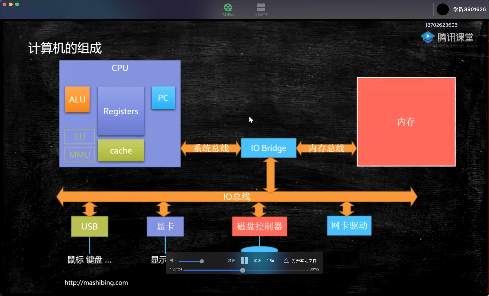
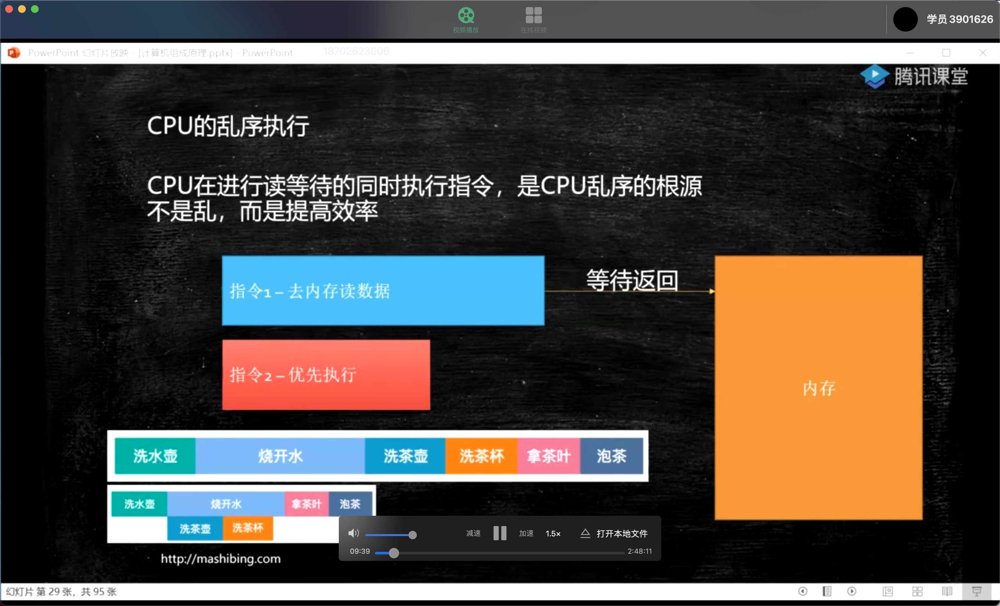

## 一、CPU的原理

计算机需要解决的最根本的问题：如何代表数字

## 二、汇编语言（机器语言）的执行

汇编语言的本质：机器语言的助记符，其实就是机器语言，

计算机同点->Cpu读取内存中的程序（电信号输入）->时钟发生器不断震荡通电->推动Cpu内部一步一步执行（执行的步数取决于指令需要的时钟周期）->计算完成->写回（电信号）->写给显卡输出

## 三、计算机的组成

## 四、CPU的基本组成

+ `PC` ：Program Counter 程序计数器(记录当前指令地址)
+ `Registers`：暂时存储CPU计算需要用到的数据
+ `ALU`：Arithmetic &Logic Unit运算单元
+ `CU`：Control Unit控制单元

+ `MMU`：Memory Management Unit 内存管理单元
+ `cache`：缓存

## 五、CPU的乱序执行

## 六、有序性保障

**Cpu内存屏障**

+ Sfence: 在sfence指令前的写操作必须在sfence指令后的写操作前完成
+ ifence:在ifence指令前的读操作必须在ifence指令后的读操作前完成
+ mfence：在mfence指令前的读写操作当必须在mfence指令后的读写操作前完成

## 七、计算机启动

