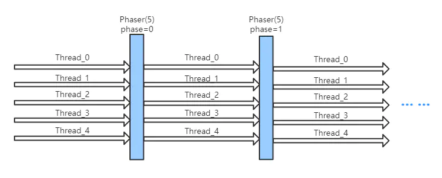

[TOC]

## 一、概述

Phaser是JDK 7新增的一个同步辅助类，在功能上跟CyclicBarrier和CountDownLatch差不多，但支持更丰富的用法。与JUC中多数同步类不同，它并不是通过AQS来实现的，而是用了另外一种同步机制


**Phaser运行示意图：**



demo

```

package com.wuzx.study_thread.demo2;

import java.util.Random;
import java.util.concurrent.Phaser;
import java.util.concurrent.TimeUnit;

public class TestPhaser {

    static Random r = new Random();

    static ManagerPhaser managerPhaser = new ManagerPhaser();


    static void milliSleep(int milli) {
        try {
            TimeUnit.MILLISECONDS.sleep(milli);
        } catch (InterruptedException e) {
            e.printStackTrace();
        }

    }

    public static void main(String[] args) {
        managerPhaser.bulkRegister(7);
        for (int i = 0; i < 5; i++) {
            final int nameIndex = i;
            new Thread(new Person("p" + i)).start();
        }

        new Thread(new Person("新郎")).start();
        new Thread(new Person("新娘")).start();
        
    }
    
    static class ManagerPhaser extends Phaser {

        @Override
        protected boolean onAdvance(int phase, int registeredParties) {
            switch (phase) {
                case 0:
                    System.out.println("所有人到齐！" + registeredParties);
                    System.out.println();
                    return false;
                case 1:
                    System.out.println("所有人吃完了！" + registeredParties);
                    System.out.println();

                    return false;
                case 2:
                    System.out.println("所有人离开了！" + registeredParties);
                    System.out.println();
                    return false;
                case 3:
                    System.out.println("婚礼结束，新郎新娘抱抱！" + registeredParties);
                    System.out.println();
                    return false;
                default:
                    return true;
                            
            }
        }
    }


    static class Person implements Runnable {
        String name;

        public Person(String name) {
            this.name = name;
        }
        
        public void arrive() {
            milliSleep(r.nextInt(1000));
            System.out.printf("%s 到达现场！\n", name);
            managerPhaser.arriveAndAwaitAdvance();
        }


        public void eat() {
            milliSleep(r.nextInt(1000));
            System.out.printf("%s 吃完！\n", name);
            managerPhaser.arriveAndAwaitAdvance();
        }
        
        
        public void leave() {
            milliSleep(r.nextInt(1000));
            System.out.printf("%s 离开！\n", name);
            managerPhaser.arriveAndAwaitAdvance();
        }
        
        public void hug() {
            if (name.equals("新郎") || name.equals("新娘")) {
                milliSleep(r.nextInt(1000));
                System.out.printf("%s 洞房！\n", name);
                managerPhaser.arriveAndAwaitAdvance();
            } else {
                managerPhaser.arriveAndDeregister();
            }
        }

        @Override
        public void run() {
            arrive();
            
            eat();

            leave();
            
            hug();
            
        }
    }
}
```