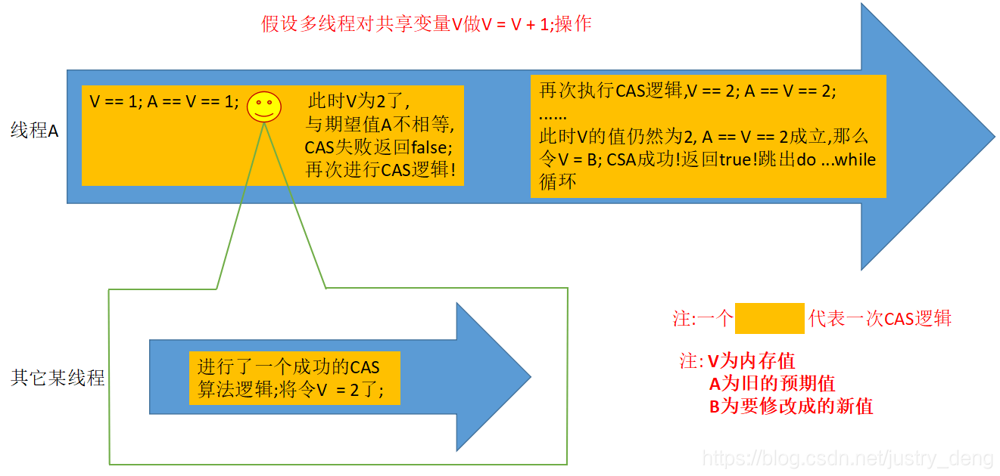
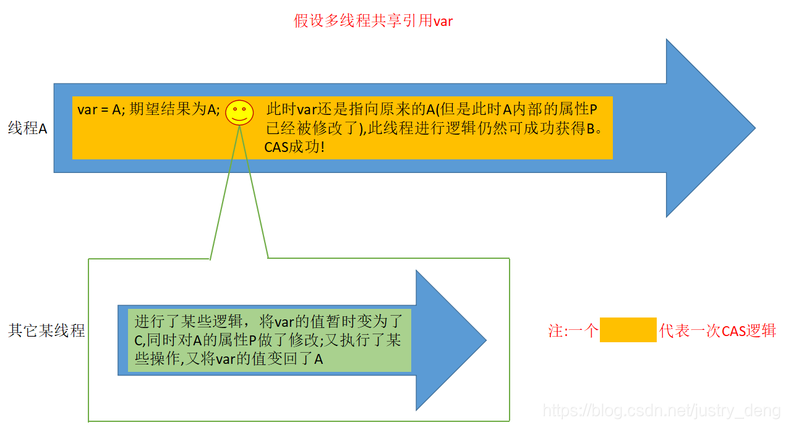
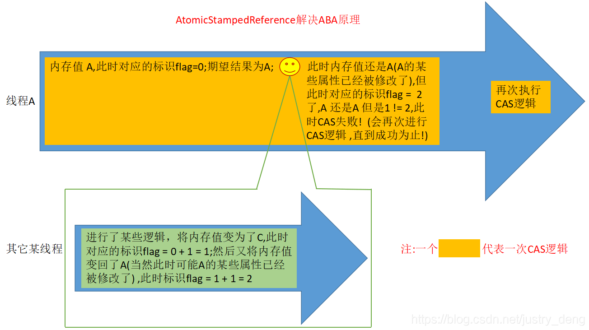

[TOC]

##  CAS(无锁优化 自旋)

compare and swap的缩写，中文翻译成比较并交换。

```
cas原理
cas（V,Expected,NewValue）

​   if v == expected

​		v = newValue

​	else try again or fail
CPU 原语支持
```

```
AtomicInteger
```



**某一线程执行一个CAS逻辑(如上图线程A),如果中途有其他线程修改了共享变量的值(如:上图中线程A执行到笑脸那一刻时),导致这个线程的CAS逻辑运算后得到的值与期望结果不一致，那么这个线程会再次执行CAS逻辑(这里是一个do while循环),直到成功为止。**


## ABA问题

**解决办法：版本version**



**如图所示，线程A进行CAS逻辑，在从内存中获取到var值到开始进行逻辑之间（对应图中笑脸处）,会有一个时间差;如果刚好在这个时间差内，有其他某线程对var做了一系列的操作,但最后又恢复了var的值，即:出现“偷梁换柱”的情况;虽然此时线程A仍然能CAS成功，但是中间多出的那些过程仍然可能引发问题**

##  解决ABA问题




**我们可以通过加一个标识来解决这个问题;即:所有要用到某一共享引用的线程，如果在用到该引用时，都对该引用对应的标识进行推进的话，那么CAS在进行“上图中笑脸前笑脸后”对比时，除了要对比原来的引用(上图中的A)外，还要对比标识的值是否一样，这样就解决了ABA问题。**


## Unsafe(直接操作JVM内存)

+ 这个类是直接操作内存
  + allocateMemory putXX freeMemory pageSize
+ 直接生成类实例
  + allocateInstance
+ 直接操作类或实例变量
  + ObjectFieldOffset
  + getInt
  + getObject
+ CAS相关操作
  + compareAndSwapObject int Long

