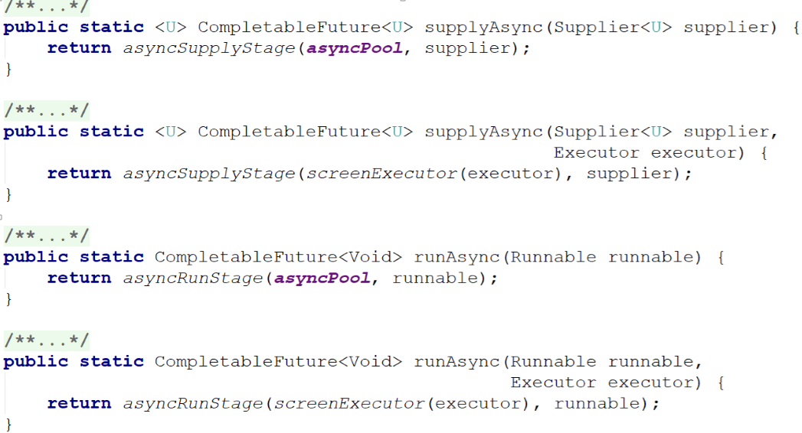
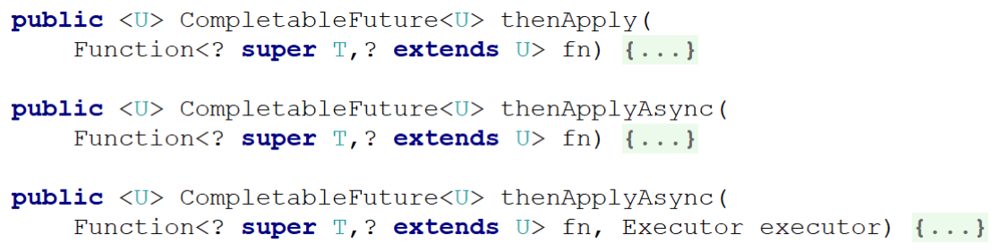

[TOC]

## CompletableFuture

### 简介

- CompletableFuture提供了非常强大的Future的扩展功能，可以帮助我们简化异步编程的复杂性，并且提供了函数式编程的能力，可以通过回调的方式处理计算结果，也提供了转换和组合 CompletableFuture 的方法。
- 它可能代表一个明确完成的Future，也有可能代表一个完成阶段（ CompletionStage ），它支持在计算完成以后触发一些函数或执行某些动作
- 它实现了Future和CompletionStage接口

### 创建CompletableFuture

### thenApply

当前阶段正常完成以后执行，而且当前阶段的执行的结果会作为下一阶段的输入参数。thenApplyAsync默认是异步执行的。这里所谓的异步指的是不在当前线程内执行。

### thenApply相当于回调函数（callback）

#### thenCombine整合两个计算结果

#### whenComplete