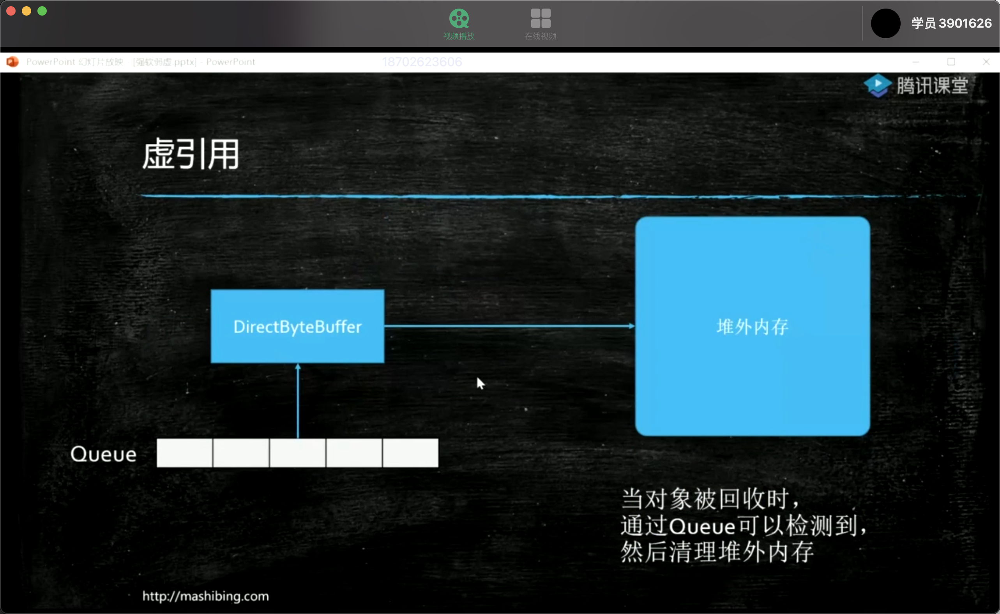

## ThreadLocal

```java
static final ThreadLocal<T> sThreadLocal = new ThreadLocal<T>();
sThreadLocal.set()
sThreadLocal.get()
```

`threadlocal`而是一个线程内部的存储类，可以在指定线程内存储数据，数据存储以后，只有指定线程可以得到存储数据，官方解释如下

```
/**
 * This class provides thread-local variables.  These variables differ from
 * their normal counterparts in that each thread that accesses one (via its
 * {@code get} or {@code set} method) has its own, independently initialized
 * copy of the variable.  {@code ThreadLocal} instances are typically private
 * static fields in classes that wish to associate state with a thread (e.g.,
 * a user ID or Transaction ID).
 */
 
 大致意思就是ThreadLocal提供了线程内存储变量的能力，这些变量不同之处在于每一个线程读取的变量是对应的互相独立的。通过get和set方法就可以得到当前线程对应的值。

做个不恰当的比喻，从表面上看ThreadLocal相当于维护了一个map，key就是当前的线程，value就是需要存储的对象。

```

### 关键方法

```java
//set 方法
public void set(T value) {
      //获取当前线程
      Thread t = Thread.currentThread();
      //实际存储的数据结构类型
      ThreadLocalMap map = getMap(t);
      //如果存在map就直接set，没有则创建map并set
      if (map != null)
          map.set(this, value);
      else
          createMap(t, value);
  }
  
//getMap方法
ThreadLocalMap getMap(Thread t) {
      //thred中维护了一个ThreadLocalMap
      return t.threadLocals;
 }
 
//createMap
void createMap(Thread t, T firstValue) {
      //实例化一个新的ThreadLocalMap，并赋值给线程的成员变量threadLocals
      t.threadLocals = new ThreadLocalMap(this, firstValue);
}
```

### ThreadLocal内存泄露问题

ThreadLocal存在内存泄漏问题，可以理解成在虚拟机垃圾回收时，会出现ThreadLocal占用内存无法被GC回收。

强引用(StrongReference)： *当JVM的内存空间不足时，宁愿抛出OutOfMemoryError使得程序异常终止也不愿意回收具有强引用的存活着的对象*。

弱引⽤(WeakReference)：*在GC的时候，不管内存空间足不足都会回收这个对象*

不难发现，ThreadLocalMap 中使⽤的 key为ThreadLocal 的弱引⽤(WeakReference)。其实单看上面的代码也不容易发现，总之要记住*ThreadLocalMap中的key为ThreadLocal的弱引用*。如果面试追问为什么是弱引用呢，可以说一下这个源码逻辑”ThreadLocalMap中的Entry对象继承了WeakReference弱引用类，


## 引用

### 1、SoftReference（软引用）

+ heap装不下，这个时候系统会垃圾回收，先收回一次，如果不够，会吧软引用干掉

## 2、weakReference(弱引用)

+ 只要有垃圾回收，就会被回收掉

+ 一般使用在容器里面
+ weakHashMap


### 3、phantomReferance虚引用

