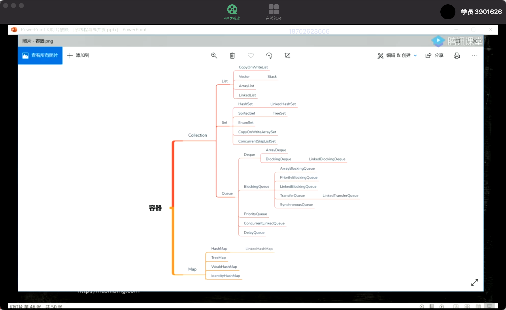

[TOC]

## 一、容器应用图解



## 二、Collection

### 1、List

#### a、Vector

+ Vector底层是数组
+ 随机访问效率高，增删效率低。通过索引可以很快的查找到对应元素，而增删元素许多元素的位置都要改变
+ 线程安全。很多方法都是synchronized的


#### b、CopyOnWriteArrayList-写时复制

CopyOnWriteArrayList的成员变量：

```
    final transient ReentrantLock lock = new ReentrantLock(); 
```

使用了ReentrantLock，每次写操作时获取锁。

```
    private transient volatile Object[] array;
```

array是CopyOnWriteArrayList里面保存的数据，transient修饰就是序列化时数据不进行序列化，volatile修饰则保障了内存可见性。

+ Add 方法

```
public boolean add(E e) {
        synchronized (lock) {
            Object[] es = getArray();
            int len = es.length;
            es = Arrays.copyOf(es, len + 1);
            es[len] = e;
            setArray(es);
            return true;
        }
    }
```

写之前总是先获取锁，然后创建一个新数组（包含原数组的内容和要添加的新元素），再将array指向新的数组。所以写操作是线程安全的，但是这样每次写的时候都要创建新数组，复制原数组的数据，是很耗时的。

**CopyOnWriteArrayList是线程安全的，但是每次修改操作时都伴随大量的复制，效率会比较低下。所以CopyOnWriteArrayList适用于读远远大于写的并发场景下**	


### 2、Set

### 3、Queue

```
public interface Queue<E> extends Collection<E> {
  
     /*
    *  add方法，在不违背队列的容量限制的情况，往队列中添加一个元素， 如果添加成功则返回true,  如果因为容量
    * 限制添加失败了，则抛出IllegalStateException异常    
    * 
    *  在有容量限制的队列中，最好使用offer方法
    *  另外，add方法相对与offer方法而言，有一个专门抛出的异常IllegalStateException，代表由于容量限制，
    * 导致不能添加元素的异常，接口中可能看不出，等看具体实现就明白了
    */
    boolean add(E e);

   /*
    *
    *  offer方法在不违背容量限制的情况，往队列中添加一个元素，如果添加元素成功，返回true，
    *  如果因为空间限制，无法添加元素则，返回false；
    *  
    *  在有容量限制的队列中，这个offer方法优于add方法，结合上文中add的注释，可知，
    *  在容量限制的队列中， add方法通过抛异常的方式表示容量已满，offer方法通过返回
    *  false的方式表示容量已满，抛异常处理更加耗时，offer直接返回false的方式更好
    * 
    */**
    boolean offer(E e);

   /*
    *  删除队列头的元素，这个方法和poll方法的不同之处在于，这个方法在队列为
    * 空的时候选择抛异常
    * 
    */
    E remove();

   /*
    *  poll方法也是删除队列头的远，如果队列为空的化，返回null
    * 
    */
    E poll();

   /*
    *  返回队列头元素，这个方法和peek方法的区别在于，入股队列为空，将抛异常
    * 
    */
    E element();

   /*
    *  返回队列头元素，如果队列为空，将返回空
    * 
    */
    E peek();
}
```


#### (1) DeLayQueue

+ 按时间进行任务调度

#### (2)BlockingQueue

#### (3)SynchronousQueue-没有容量(同步)

+ 与其他BlockingQueue不同,SynchronousQueue是一个不存储元素的BlockingQueue。
  每一个put操作必须要等待一个take操作,否则不能继续添加元素,反之亦然。

#### (4)LinkedTransferQueue（传递）

+ 使用场景：要求使用一个结果，执行一次性任务


## 三、Map

#### a、HashTable

+ Hashtable是基于哈希表的Map接口的同步实现，不允许使用null值和null键
+ 底层使用数组实现，数组中每一项是个单链表，即数组和链表的结合体
+ Hashtable在底层将key-value当成一个整体进行处理，这个整体就是一个Entry对象
+ Hashtable底层采用一个Entry[]数组来保存所有的key-value对，当需要存储一个Entry对象时，会根据key的hash算法来决定其在数组中的存储位置，在根据equals方法决定其在该数组位置上的链表中的存储位置；当需要取出一个Entry时，也会根据key的hash算法找到其在数组中的存储位置，再根据equals方法从该位置上的链表中取出该Entry
+ synchronized是针对整张Hash表的，即每次锁住整张表让线程独占


#### b、ConcurrentMap

+ ConcurrentHashMap是一个线程安全，并且是一个高效的HashMap
+ 与HashMap不同的是，ConcurrentHashMap中多了一层数组结构，由Segment和HashEntry两个数组组成。其中Segment起到了加锁同步的作用，而HashEntry则起到了存储K.V键值对的作用。
+ 在多线程中，每一个Segment对象守护了一个HashEntry数组，当对ConcurrentHashMap中的元素修改时，在获取到对应的Segment数组角标后，都会对此Segment对象加锁，之后再去操作后面的HashEntry元素，这样每一个Segment对象下，都形成了一个小小的HashMap，在保证数据安全性的同时，又提高了同步的效率。只要不是操作同一个Segment对象的话，就不会出现线程等待的问题！

