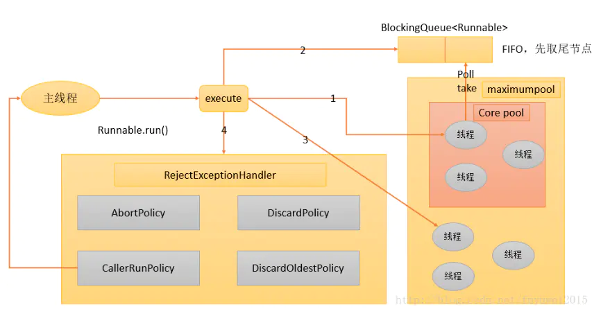

## 线程池

###  一、两种类型线程池

+ ThreadPoolExecutor
+ ForkJoinPool
  + 分解汇总的任务
  + 用很少的线程可以执行很多的任务(子任务)TPE做不到先执行子任务
  + CPU密集型

### 二、ThreadPoolExecutor

线程池里面维护这两个集合

+ 线程的集合
+ 任务的集合



#### 线程池有哪些配置

```
public ThreadPoolExecutor(int corePoolSize,
                              int maximumPoolSize,
                              long keepAliveTime,
                              TimeUnit unit,
                              BlockingQueue<Runnable> workQueue,
                              ThreadFactory threadFactory,
                              RejectedExecutionHandler handler)
```

+ `corePoolSize`:核心线程数	
+ `maximumPoolSize`:线程池最大线程数，表示在线程池中最多能创建多少个线程。如果当线程池中的数量到达这个数字时，新来的任务会抛出异常。
+ `keepAliveTime`:生存时间
+ `unit`:生存时间单位
+ `workQueue`:任务队列
+ `threadFactory`:线程工厂，主要用来创建线程，比如指定线程的名字,是否是守护线程，优先级等等
+ `RejectedExecutionHandler`:拒绝策略，任务队列满，线程池超过最大线程数，然后就是执行拒绝策略，jdk默认提供4中，这个可以自定义，Abort:抛异常；Discard：扔掉，不抛异常；DiscardOldest:扔掉排队时间最久的;CallerRuns：调用者处理任务